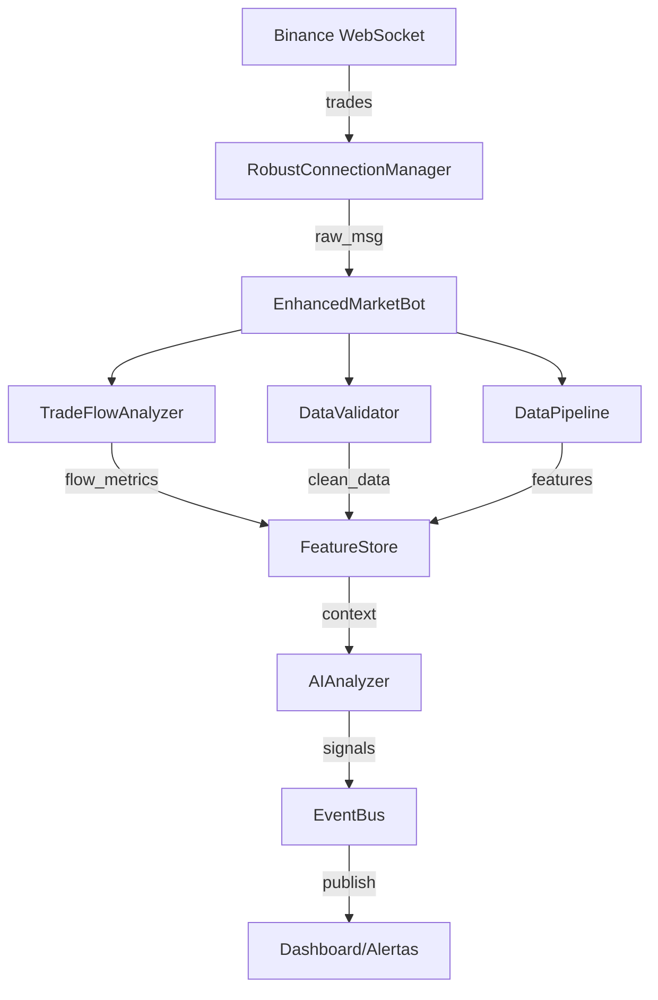

# 🏗️ Arquitetura do Sistema

> Bot de análise de mercado Binance com integração de IA

## Visão Geral

O sistema coleta dados em tempo real via WebSocket, processa em pipeline multi-camadas, e envia para modelos de IA para análise.

```
┌─────────────┐     ┌──────────────────┐     ┌─────────────────┐
│   BINANCE   │────▶│  WebSocket API   │────▶│ Trading Bot     │
│  (Exchange) │     │  (Tempo Real)    │     │ (Este Sistema)  │
└─────────────┘     └──────────────────┘     └─────────────────┘
```

---

## Fluxo de Dados



---

## Camadas do Sistema

| Camada | Responsabilidade | Arquivos |
|--------|------------------|----------|
| **Conexão** | WebSocket, reconexão, heartbeat | `robust_connection.py` |
| **Orquestração** | Coordena componentes, janelas | `market_orchestrator.py` |
| **Fluxo** | CVD, whale flow, net flow | `flow_analyzer.py` |
| **Validação** | Limpa dados, detecta anomalias | `data_validator.py` |
| **Pipeline** | OHLC, métricas, features | `data_pipeline/` |
| **IA** | Análise com Groq/DashScope | `ai_analyzer_qwen.py` |
| **Eventos** | Pub/sub de sinais | `event_bus.py` |

---

## Módulos Principais

### `market_orchestrator/connection/robust_connection.py`
Gerenciador de WebSocket com reconexão automática e backoff exponencial.

### `market_orchestrator/market_orchestrator.py`
Orquestrador principal (`EnhancedMarketBot`). Recebe trades, coordena análise, emite eventos.

### `flow_analyzer.py`
Calcula métricas de fluxo: CVD, whale flow, burst detection. Usa `Decimal` para precisão.

### `data_validator.py`
Valida e corrige dados: timestamps, volumes, deltas. Detecta duplicatas.

### `data_pipeline/pipeline.py`
Pipeline de 4 camadas: Validação → Enrich → Context → Features.

### `ai_analyzer_qwen.py`
Integração com IA (Groq prioritário, fallback DashScope/OpenAI).

### `feature_store.py`
Armazena features em Parquet, particionado por data.

### `config.py`
Configurações centralizadas (conexão, IA, validação, etc.).

---

## Configurações Críticas

| Variável | Valor Padrão | Descrição |
|----------|--------------|-----------|
| `WS_PING_INTERVAL` | 20s | Intervalo de ping WebSocket |
| `WS_MAX_RECONNECT_ATTEMPTS` | 15 | Tentativas de reconexão |
| `HEALTH_CHECK_INTERVAL` | 30s | Intervalo de health check |
| `GROQ_API_KEY` | env | Chave da API Groq |
| `WINDOW_DURATION` | 5s | Duração da janela de análise |

---

## Diagrama de Componentes

```
┌──────────────────────────────────────────────────────────────┐
│                         main.py                              │
│  ┌─────────────────────────────────────────────────────────┐ │
│  │                  EnhancedMarketBot                      │ │
│  │  ┌──────────────┐  ┌──────────────┐  ┌───────────────┐  │ │
│  │  │ Connection   │  │ FlowAnalyzer │  │ DataValidator │  │ │
│  │  │ Manager      │  │              │  │               │  │ │
│  │  └──────────────┘  └──────────────┘  └───────────────┘  │ │
│  │  ┌──────────────┐  ┌──────────────┐  ┌───────────────┐  │ │
│  │  │ DataPipeline │  │ FeatureStore │  │  AIAnalyzer   │  │ │
│  │  └──────────────┘  └──────────────┘  └───────────────┘  │ │
│  └─────────────────────────────────────────────────────────┘ │
└──────────────────────────────────────────────────────────────┘
```

---

## Tecnologias

- **Python 3.12+**
- **aiohttp** - WebSocket async
- **NumPy/Pandas** - Processamento de dados
- **Groq/DashScope** - APIs de IA
- **Parquet** - Armazenamento de features
