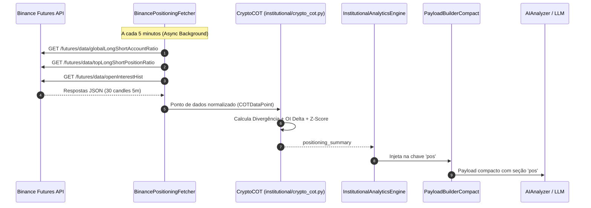

# DESIGN TÉCNICO: BINANCE POSITIONING & CRYPTO COT (FASE P1.1)
**Projeto:** Robô de Trading Binance API  
**Data:** 2026-09-01  
**Status:** ESPECIFICAÇÃO DE ARQUITETURA PRÉ-IMPLEMENTAÇÃO (READ-ONLY)  
**Versão:** 1.0.0  

---

## 1. OBJETIVO E MOTIVAÇÃO

O objetivo da Fase P1.1 é integrar os dados reais de **Posicionamento e Sentimento Institucional da Binance Futures** para alimentar o módulo institucional `institutional/crypto_cot.py`, permitindo detectar divergências entre o posicionamento do varejo e dos *Top Traders*.

---

## 2. ENDPOINTS OFICIAIS DA BINANCE FUTURES (API PÚBLICA)

Os dados são disponibilizados pela API de dados de mercado da Binance Futures (`fapi.binance.com`), sem necessidade de autenticação privada ou cobrança adicional:

### 2.1. Global Long/Short Account Ratio
- **Endpoint:** `GET https://fapi.binance.com/futures/data/globalLongShortAccountRatio`
- **Parâmetros:** `symbol=BTCUSDT`, `period=5m`, `limit=30`
- **Schema de Resposta:**
```json
[
  {
    "symbol": "BTCUSDT",
    "longAccount": "0.6850",
    "shortAccount": "0.3150",
    "longShortRatio": "2.1746",
    "timestamp": 1788309600000
  }
]
```
- **Significado:** % de todas as contas da Binance com posições líquidas compradas vs vendidas.

---

### 2.2. Top Trader Long/Short Account Ratio
- **Endpoint:** `GET https://fapi.binance.com/futures/data/topLongShortAccountRatio`
- **Parâmetros:** `symbol=BTCUSDT`, `period=5m`, `limit=30`
- **Schema de Resposta:**
```json
[
  {
    "symbol": "BTCUSDT",
    "longAccount": "0.5420",
    "shortAccount": "0.4580",
    "longShortRatio": "1.1834",
    "timestamp": 1788309600000
  }
]
```
- **Significado:** % das contas dos top 20% traders por volume de margem posicionadas na compra vs venda.

---

### 2.3. Top Trader Long/Short Position Ratio
- **Endpoint:** `GET https://fapi.binance.com/futures/data/topLongShortPositionRatio`
- **Parâmetros:** `symbol=BTCUSDT`, `period=5m`, `limit=30`
- **Schema de Resposta:**
```json
[
  {
    "symbol": "BTCUSDT",
    "longPosition": "0.6130",
    "shortPosition": "0.3870",
    "longShortRatio": "1.5839",
    "timestamp": 1788309600000
  }
]
```
- **Significado:** % do volume total de contratos abertos pelos top 20% traders alocado em posições compradas vs vendidas.

---

### 2.4. Open Interest History (OI Delta)
- **Endpoint:** `GET https://fapi.binance.com/futures/data/openInterestHist`
- **Parâmetros:** `symbol=BTCUSDT`, `period=5m`, `limit=30`
- **Schema de Resposta:**
```json
[
  {
    "symbol": "BTCUSDT",
    "sumOpenInterest": "112450.45",
    "sumOpenInterestValue": "8678912345.12",
    "timestamp": 1788309600000
  }
]
```

---

## 3. REGRA ESTRITA DE SEPARAÇÃO SEMÂNTICA

É **terminantemente proibido** mesclar ou calcular médias simples entre:
1. `global_account_ratio` (número de contas do varejo)
2. `top_account_ratio` (número de contas institucionais)
3. `top_position_ratio` (tamanho financeiro real do posicionamento institucional)

### Justificativa Microestrutural:
- No varejo, 70% das contas podem estar compradas (`global_account_ratio = 2.33`), mas com posições microscópicas.
- Ao mesmo tempo, os Top Traders podem ter 55% das contas compradas (`top_account_ratio = 1.22`), porém alocando 75% do seu capital em posições vendidas (`top_position_ratio = 0.33`).
- Essa assimetria revela **Distribuição Institucional Oculta**. Mesclar essas grandezas destrói o sinal de alfa.

---

## 4. DESIGN DOS INDICADORES DERIVADOS

| Métrica Derivada | Fórmula de Cálculo | Informação Nova (Alfa) | Redundância | Custo Tokens | Risco Semântico |
|---|---|---|---|---|---|
| **`top_vs_global_divergence`** | $\text{top\_pos\_ratio} - \text{global\_acc\_ratio}$ | Divergência direta entre institucionais e varejo | Nenhuma | ~8 tokens | Baixo se normalizado |
| **`oi_delta_1h`** | $(\text{OI}_t - \text{OI}_{t-1h}) / \text{OI}_{t-1h}$ | Entrada ou saída líquida de capital especulativo | Complementar ao volume | ~6 tokens | Baixo |
| **`oi_delta_4h`** | $(\text{OI}_t - \text{OI}_{t-4h}) / \text{OI}_{t-4h}$ | Tendência estrutural de alavancagem | Parcialmente correlacionado ao 1h | ~6 tokens | Baixo |
| **`funding_zscore`** | $(\text{FR}_t - \mu_{30d}) / \sigma_{30d}$ | Extremo estatístico de custo de financiamento | Substitui o valor nominal puro | ~6 tokens | Muito baixo |
| **`positioning_regime`** | Classificação categórica (ex: `INST_ACCUM`, `CROWD_LONG`, `SQUEEZE_RISK`) | Síntese pré-processada de alta interpretabilidade | Alta vs métricas brutas | ~10 tokens | Requer validação de thresholds |

---

## 5. INTEGRAÇÃO NO PAYLOAD COMPACTO v3.1

Para não violar o orçamento de tokens da IA (~720 tokens totais), o posicionamento deve ser resumido na seção compacta `"pos"`:

```json
"pos": {
  "g_ls": 2.17,
  "t_pos": 0.85,
  "div": -1.32,
  "oi_1h": "+2.4%",
  "rgm": "CROWD_LONG_INST_HEDGE"
}
```

**Impacto de Tokens:** $+25$ tokens (completamente acomodável dentro da folga atual de ~180 tokens).

---

## 6. DIAGRAMA DA ARQUITETURA PROPOSTA (FASE P1.1)


