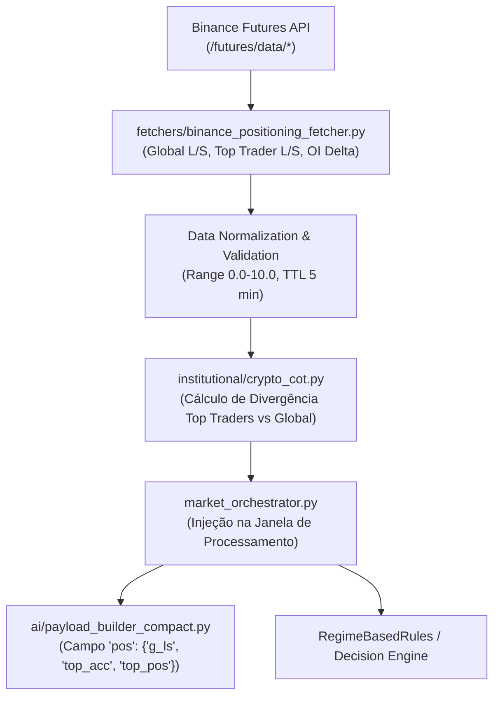

# AUDITORIA TÉCNICA DAS 57 CAPACIDADES INSTITUCIONAIS
**Projeto:** Robô de Trading Binance API  
**Data:** 2026-09-01  
**Escopo:** Código-fonte estrito em produção (HEAD `4c59934`)  
**Status do Repositório:** READ-ONLY / CODE FREEZE  

---

## 1. SUMÁRIO EXECUTIVO E MATRIZ GERAL DE CAPACIDADES

A presente auditoria avaliou exaustivamente **57 capacidades institucionais** anunciadas ou prototipadas no ecossistema da aplicação, rastreando a cadeia completa:
$$\text{Source} \longrightarrow \text{Fetcher/WS} \longrightarrow \text{Processamento} \longrightarrow \text{Cálculo} \longrightarrow \text{Validação} \longrightarrow \text{Orquestrador} \longrightarrow \text{Payload IA} \longrightarrow \text{ML} \longrightarrow \text{Decisão}$$

### Convenção de Símbolos:
- ✅ **Confirmado (Live + Integrado)**
- ⚠️ **Parcial / Derivado / Degradado**
- ☠️ **Código Morto / Módulo Órfão (Implementado mas desconectado)**
- ❌ **Inexistente no Código**

---

### MATRIZ CONSOLIDADA DAS 57 CAPACIDADES

| # | Capacidade | Impl | Int | Live | Valid | AI | ML | Decision | Status Geral |
|---|---|:---:|:---:|:---:|:---:|:---:|:---:|:---:|:---:|
| **ORDER FLOW** | | | | | | | | | |
| 1 | Footprint por nível de preço | ✅ | ❌ | ❌ | ⚠️ | ❌ | ❌ | ❌ | ☠️ Módulo Órfão (`footprint.py`) |
| 2 | DOM / Orderbook | ✅ | ✅ | ✅ | ✅ | ✅ | ✅ | ✅ | ✅ Live Integrado |
| 3 | CVD (Cumulative Volume Delta) | ✅ | ✅ | ✅ | ✅ | ✅ | ✅ | ✅ | ✅ Live Integrado |
| 4 | Time & Sales | ✅ | ✅ | ✅ | ✅ | ✅ | ✅ | ✅ | ✅ Live Integrado |
| 5 | Order Flow Imbalance (OFI / Trade Imb) | ✅ | ⚠️ | ⚠️ | ✅ | ✅ | ✅ | ✅ | ⚠️ Trade Imb ✅ / L2 OFI ☠️ |
| 6 | Iceberg Detection | ✅ | ✅ | ✅ | ⚠️ | ✅ | ❌ | ⚠️ | ⚠️ Live Simplificado |
| 7 | Absorption | ✅ | ✅ | ✅ | ✅ | ✅ | ❌ | ✅ | ✅ Live Integrado |
| **VOLUME / AUCTION** | | | | | | | | | |
| 8 | Volume Profile (POC/VAL/VAH/HVN/LVN) | ✅ | ✅ | ✅ | ✅ | ✅ | ❌ | ✅ | ✅ Live Integrado |
| 9 | Market Profile / TPO (Brackets) | ❌ | ❌ | ❌ | ❌ | ❌ | ❌ | ❌ | ❌ Inexistente |
| 10 | Auction Market Theory (AMT State) | ✅ | ✅ | ✅ | ✅ | ✅ | ❌ | ❌ | ⚠️ Derivado do VP / Contextual |
| 11 | VWAP | ✅ | ⚠️ | ⚠️ | ⚠️ | ⚠️ | ❌ | ❌ | ⚠️ Intraday Parcial / Órfão |
| 12 | TWAP | ✅ | ✅ | ✅ | ✅ | ✅ | ❌ | ❌ | ✅ Live Integrado |
| **QUANT** | | | | | | | | | |
| 13 | StatArb / Cointegration | ❌ | ❌ | ❌ | ❌ | ❌ | ❌ | ❌ | ❌ Inexistente |
| 14 | Mean Reversion (OU / Z-Score) | ✅ | ❌ | ❌ | ⚠️ | ❌ | ❌ | ❌ | ☠️ Módulo Órfão (`mean_reversion.py`) |
| 15 | Momentum / Trend (ADX/RSI/MACD/EMA) | ✅ | ✅ | ✅ | ✅ | ✅ | ✅ | ✅ | ✅ Live Integrado |
| 16 | Machine Learning (XGBoost) | ✅ | ✅ | ✅ | ✅ | ✅ | N/A | ⚠️ | ⚠️ Inference Ativa / Trade Off |
| 17 | Monte Carlo Simulation | ✅ | ✅ | ✅ | ✅ | ✅ | ❌ | ❌ | ✅ Live Integrado |
| 18 | HMM / Market Regime | ✅ | ✅ | ✅ | ✅ | ✅ | ❌ | ✅ | ✅ Live Heurístico / HMM ☠️ |
| 19 | GARCH Volatility | ✅ | ✅ | ✅ | ✅ | ✅ | ❌ | ❌ | ✅ Live Integrado |
| 20 | Kyle Lambda / Market Impact | ✅ | ✅ | ✅ | ✅ | ✅ | ❌ | ❌ | ⚠️ Book Walking (Kyle λ ❌) |
| 21 | Hurst Exponent | ✅ | ✅ | ✅ | ✅ | ✅ | ❌ | ❌ | ✅ Live Integrado |
| 22 | Fractal Analysis (Higuchi/Dimension) | ✅ | ✅ | ✅ | ✅ | ✅ | ❌ | ❌ | ✅ Live Integrado |
| 23 | Shannon Entropy | ✅ | ✅ | ✅ | ✅ | ✅ | ❌ | ❌ | ✅ Live Integrado |
| 24 | Fourier Analysis (Dominant Cycles) | ✅ | ✅ | ✅ | ✅ | ✅ | ❌ | ❌ | ✅ Live Integrado |
| 25 | Kalman Filter | ✅ | ✅ | ✅ | ✅ | ✅ | ❌ | ❌ | ✅ Live Integrado |
| 26 | Dynamic Regression (Channel/Slope) | ✅ | ✅ | ✅ | ✅ | ✅ | ❌ | ❌ | ✅ Live Integrado |
| **LIQUIDITY / DERIVATIVES** | | | | | | | | | |
| 27 | Liquidity Heatmap (Clustering) | ✅ | ✅ | ✅ | ✅ | ✅ | ❌ | ❌ | ✅ Live Integrado |
| 28 | Liquidation Map | ❌ | ❌ | ❌ | ❌ | ❌ | ❌ | ❌ | ❌ Inexistente (Apenas Config) |
| 29 | Open Interest (OI) | ✅ | ✅ | ✅ | ✅ | ✅ | ❌ | ❌ | ✅ Live Integrado |
| 30 | Funding Rate | ✅ | ✅ | ✅ | ✅ | ✅ | ❌ | ❌ | ✅ Live Integrado |
| 31 | Gamma Exposure (GEX) | ❌ | ❌ | ❌ | ❌ | ❌ | ❌ | ❌ | ❌ Inexistente |
| **ON-CHAIN** | | | | | | | | | |
| 32 | Whale Trades (>= 1.0 BTC) | ✅ | ✅ | ✅ | ✅ | ✅ | ❌ | ✅ | ✅ Live Integrado |
| 33 | Whale Wallet Tracking | ❌ | ❌ | ❌ | ❌ | ❌ | ❌ | ❌ | ❌ Inexistente |
| 34 | Exchange Inflow / Outflow | ❌ | ❌ | ❌ | ❌ | ❌ | ❌ | ❌ | ❌ Inexistente |
| 35 | MVRV | ❌ | ❌ | ❌ | ❌ | ❌ | ❌ | ❌ | ❌ Inexistente |
| 36 | SOPR | ❌ | ❌ | ❌ | ❌ | ❌ | ❌ | ❌ | ❌ Inexistente |
| 37 | NVT | ❌ | ❌ | ❌ | ❌ | ❌ | ❌ | ❌ | ❌ Inexistente |
| 38 | Realized Price | ❌ | ❌ | ❌ | ❌ | ❌ | ❌ | ❌ | ❌ Inexistente |
| 39 | Miner Metrics (Hashrate/Difficulty) | ✅ | ❌ | ❌ | ⚠️ | ❌ | ❌ | ❌ | ☠️ Desabilitado (`ENABLE_ONCHAIN=F`) |
| **SENTIMENT / POSITIONING** | | | | | | | | | |
| 40 | Fear & Greed Index | ✅ | ✅ | ✅ | ✅ | ✅ | ❌ | ❌ | ✅ Live Integrado |
| 41 | NLP Sentiment | ❌ | ❌ | ❌ | ❌ | ❌ | ❌ | ❌ | ❌ Inexistente |
| 42 | Global Long/Short Account Ratio | ❌ | ❌ | ❌ | ❌ | ❌ | ❌ | ❌ | ❌ Não Conectado à API |
| 43 | Top Trader L/S Account Ratio | ❌ | ❌ | ❌ | ❌ | ❌ | ❌ | ❌ | ❌ Não Conectado à API |
| 44 | Top Trader L/S Position Ratio | ❌ | ❌ | ❌ | ❌ | ❌ | ❌ | ❌ | ❌ Não Conectado à API |
| 45 | Crypto COT Equivalent | ✅ | ❌ | ❌ | ⚠️ | ❌ | ❌ | ❌ | ☠️ Módulo Órfão (`crypto_cot.py`) |
| **MARKET STRUCTURE** | | | | | | | | | |
| 46 | Wyckoff Analysis | ❌ | ❌ | ❌ | ❌ | ❌ | ❌ | ❌ | ❌ Inexistente |
| 47 | SMC / ICT Engine | ✅ | ❌ | ❌ | ⚠️ | ❌ | ❌ | ❌ | ☠️ Módulo Órfão (`smart_money.py`) |
| 48 | Order Blocks (ICT) | ✅ | ❌ | ❌ | ⚠️ | ❌ | ❌ | ❌ | ☠️ Módulo Órfão (`smart_money.py`) |
| 49 | Fair Value Gap (FVG) | ✅ | ✅ | ✅ | ✅ | ✅ | ❌ | ❌ | ✅ Live Integrado |
| 50 | Liquidity Sweep | ✅ | ❌ | ❌ | ⚠️ | ❌ | ❌ | ❌ | ☠️ Módulo Órfão (`smart_money.py`) |
| 51 | Supply / Demand Defense Zones | ✅ | ✅ | ✅ | ✅ | ✅ | ❌ | ✅ | ✅ Live Integrado |
| 52 | Break of Structure (BOS) | ✅ | ❌ | ❌ | ⚠️ | ❌ | ❌ | ❌ | ☠️ Módulo Órfão (`smart_money.py`) |
| 53 | Market Structure Shift (MSS / CHoCH) | ❌ | ❌ | ❌ | ❌ | ❌ | ❌ | ❌ | ❌ Inexistente |
| **OPTIONS** | | | | | | | | | |
| 54 | Options Flow | ❌ | ❌ | ❌ | ❌ | ❌ | ❌ | ❌ | ❌ Inexistente |
| 55 | Black-Scholes Model | ❌ | ❌ | ❌ | ❌ | ❌ | ❌ | ❌ | ❌ Inexistente |
| 56 | Option Greeks (Δ, Γ, ν, θ) | ❌ | ❌ | ❌ | ❌ | ❌ | ❌ | ❌ | ❌ Inexistente |
| 57 | GEX (Gamma Exposure) | ❌ | ❌ | ❌ | ❌ | ❌ | ❌ | ❌ | ❌ Inexistente |

---

### RESUMO ESTATÍSTICO CONSOLIDADO

1. **Capacidades Realmente LIVE:** **23** (40.4%)
2. **Capacidades Expostas à IA (Payload LLM):** **26** (45.6%)
3. **Capacidades Usadas como Feature no Modelo ML:** **5** (8.8% — `price_close`, `returns`, `bb_bands`, `rsi`, `volume_ratio`/`flow_imbalance`)
4. **Capacidades que Influenciam Decisão / Risk / Sinal:** **8** (14.0% — CVD/Delta, Absorção, Orderbook Walls, Regime Rules, Trend Multi-TF, Defense Zones, Whale Distribution, Trade Counts)
5. **Módulos Institucionais Órfãos / Desconectados:** **11** (`institutional/footprint.py`, `order_flow_imbalance.py`, `crypto_cot.py`, `smart_money.py`, `mean_reversion.py`, `market_regime_hmm.py`, `onchain_fetcher.py`, etc.)
6. **Capacidades com Divergência Semântica:** **4** (Kyle Lambda vs Book-Walking; Auction State vs VP Value Area; Trade Flow Imbalance vs L2 OFI; Order Blocks vs Confluence Zones)
7. **Maior Risco de Corrupção Silenciosa:** Delta pós-reset em buffers sem trades; unidades de Funding Rate em fallbacks sem normalização canônica; truncamento de histórico em RollingAggregate de alta frequência.
8. **Top 10 Melhorias de Maior ROI:** Listadas na Seção 8 deste documento.

---

## 2. AUDITORIA DETALHADA DAS 57 CAPACIDADES

### CATEGORIA 1: ORDER FLOW (1 a 7)

#### 1. Footprint por Nível de Preço
- **STATUS:** ☠️ ÓRFÃO / DESCONECTADO
- **IMPLEMENTED:** YES (`institutional/footprint.py:111`, classe `FootprintAnalyzer`)
- **INTEGRATED:** NO (importado apenas em `institutional/event_bridge.py:18` e em `test_institutional_footprint.py`)
- **LIVE_DATA:** NO (não recebe o feed de trades do `EnhancedMarketBot`)
- **VALIDATED:** PARTIAL (`tests/unit/test_institutional_footprint.py`)
- **AI_EXPOSED:** NO
- **ML_EXPOSED:** NO
- **DECISION_USED:** NO
- **SOURCE:** Nenhuma no runtime
- **FILES:** `institutional/footprint.py`
- **PROBLEMS:** O módulo implementa agrupamento bid/ask por tick de preço, mas o orquestrador utiliza apenas `LiquidityHeatmap` (clustering DBSCAN). O Footprint granular não é alimentado pelos trades reais.
- **RECOMMENDATION:** Conectar `FootprintAnalyzer` ao `window_processor.py` apenas se houver necessidade de visualização gráfica; para IA, o `LiquidityHeatmap` é mais eficiente em tokens.

#### 2. DOM / Orderbook
- **STATUS:** ✅ LIVE INTEGRADO
- **IMPLEMENTED:** YES (`orderbook_analyzer/core.py:255`, classe `OrderBookAnalyzer`; `orderbook_core/orderbook.py:20`)
- **INTEGRATED:** YES (`market_orchestrator/market_orchestrator.py:228`, instanciado e executado a cada janela)
- **LIVE_DATA:** YES (`wss://stream.binance.com:9443/ws/btcusdt@depth` + snapshot REST fallback)
- **VALIDATED:** YES (`tests/unit/test_orderbook_analyzer.py`, `SpreadTracker`, circuit breaker com 3 estados)
- **AI_EXPOSED:** YES (`payload["ob"]`: `imb`, `sp_bps`, `src`, `bd`, `ad`, `walls`)
- **ML_EXPOSED:** YES (`microstructure.order_book_slope` em `common/ml_features.py:658`)
- **DECISION_USED:** YES (emite alertas de muralha de liquidez, define flag de degradação `orderbook_source`)
- **UNIT:** USD (`depth_usd`), bps (`spread_bps`), fracionário [-1.0, 1.0] (`imbalance`)
- **FRESHNESS:** TTL 15.0s, Max Stale 60.0s

#### 3. CVD (Cumulative Volume Delta)
- **STATUS:** ✅ LIVE INTEGRADO
- **IMPLEMENTED:** YES (`flow_analyzer/core.py:119`, `flow_analyzer/aggregates.py:28`)
- **INTEGRATED:** YES (atualizado via `AsyncTradeBuffer` a cada batch de trades e consolidado em janelas)
- **LIVE_DATA:** YES (`wss://stream.binance.com:9443/ws/btcusdt@trade`)
- **VALIDATED:** YES (`data_quality_validator.py`, `delta_validator.py`, `test_flow_analyzer_metrics.py`)
- **AI_EXPOSED:** YES (`payload["flow"]`: `d` [delta BTC], `vol` [volume BTC], `cvd_d` [divergência], `d_z` [z-score])
- **ML_EXPOSED:** YES (`microstructure.flow_imbalance`, `BSpress`)
- **DECISION_USED:** YES (threshold dinâmico de delta dispara `ANALYSIS_TRIGGER`; validação de reversão)
- **UNIT:** BTC (volume base)
- **FRESHNESS:** Real-time (<50ms de latência interna)

#### 4. Time & Sales
- **STATUS:** ✅ LIVE INTEGRADO
- **IMPLEMENTED:** YES (`trading/trade_buffer.py:20`, `market_orchestrator/windows/window_processor.py:40`)
- **INTEGRATED:** YES (buffer assíncrono conectado ao loop principal de eventos)
- **LIVE_DATA:** YES (`btcusdt@trade` Binance stream)
- **VALIDATED:** YES (`trade_validator.py`, `trade_timestamp_validator.py` valida ordenação e latência)
- **AI_EXPOSED:** YES (métricas agregadas: `trade_count`, `total_buy_volume`, `total_sell_volume`, `twap`)
- **ML_EXPOSED:** YES (`returns_1`, `returns_5`, `tick_rule_sum`)
- **DECISION_USED:** YES (janelas com menos de 10 trades não disparam pipeline analítico)
- **UNIT:** Timestamp ms, Preço USDT, Qty BTC, Direção BuyerMaker bool

#### 5. Order Flow Imbalance (OFI / Trade Flow Imbalance)
- **STATUS:** ⚠️ PARCIAL (Trade Flow Imbalance ✅ LIVE / L2 OFI ☠️ ÓRFÃO)
- **IMPLEMENTED:** YES (`flow_analyzer/metrics.py:45` para Trade Imbalance; `institutional/order_flow_imbalance.py:62` para L2 OFI)
- **INTEGRATED:** PARTIAL (Trade Imbalance está integrado; L2 OFI é órfão)
- **LIVE_DATA:** YES (para Trade Imbalance via trades reais)
- **VALIDATED:** YES (`test_flow_analyzer_metrics.py`)
- **AI_EXPOSED:** YES (`flow.imb`, `ML: FlowImb=...` no log e payload)
- **ML_EXPOSED:** YES (`microstructure.flow_imbalance`)
- **DECISION_USED:** YES (dispara alerta `FLOW_EXTREME_IMBALANCE` em desvios > 50%)
- **PROBLEMS:** O sistema chama `Trade Flow Imbalance` de `FlowImbalance`. O verdadeiro `L2 OFI` (variação de níveis de bid/ask entre snapshots) está isolado em `institutional/order_flow_imbalance.py`.
- **RECOMMENDATION:** Manter a distinção conceitual na documentação e manter `Trade Flow Imbalance` ativo por ser computacionalmente leve.

#### 6. Iceberg Detection
- **STATUS:** ⚠️ LIVE SIMPLIFICADO
- **IMPLEMENTED:** YES (`institutional/enricher.py:1033-1047`; `institutional/iceberg_detector.py:35` órfão)
- **INTEGRATED:** YES (`enricher.py` analisa trades repetidos no mesmo preço no fechamento da janela)
- **LIVE_DATA:** YES (executado sobre a janela de trades reais)
- **VALIDATED:** PARTIAL (heurística de contagem de trades no mesmo nível com volume acumulado relevante)
- **AI_EXPOSED:** YES (`w.ice` booleano no payload compacto)
- **ML_EXPOSED:** NO
- **DECISION_USED:** PARTIAL (eleva score de atividade institucional)

#### 7. Absorption
- **STATUS:** ✅ LIVE INTEGRADO
- **IMPLEMENTED:** YES (`flow_analyzer/absorption.py:15`, `flow_analyzer/core.py:300`)
- **INTEGRATED:** YES (`FlowAnalyzer` dispara eventos `Absorção`, processados por `market_orchestrator.py:975`)
- **LIVE_DATA:** YES (trades agressivos vs variação de preço em tempo real)
- **VALIDATED:** YES (`tests/unit/test_signal_direction_absorption.py`, `test_absorption_prod_test.py`)
- **AI_EXPOSED:** YES (gera trigger prioritário `ABS`, bypass de cooldown de 5 min)
- **ML_EXPOSED:** NO
- **DECISION_USED:** YES (gera sinal direcional primário de compra ou venda)
- **UNIT:** Threshold base 0.15 (ajustado dinamicamente por volatilidade)

---

### CATEGORIA 2: VOLUME / AUCTION (8 a 12)

#### 8. Volume Profile (POC, VAL, VAH, HVN, LVN)
- **STATUS:** ✅ LIVE INTEGRADO
- **IMPLEMENTED:** YES (`support_resistance/volume_profile.py:19`, `support_resistance/system.py:50`)
- **INTEGRATED:** YES (`InstitutionalAnalyticsEngine` coordena o cálculo a cada janela)
- **LIVE_DATA:** YES (OHLC diário/semanal/mensal + trades da sessão)
- **VALIDATED:** YES (`test_volume_profile_etapa4_regression.py`, invariante `VAL < POC < VAH` estrito)
- **AI_EXPOSED:** YES (`sr.poc`, `sr.val`, `sr.vah`, `sr.hvn`, `sr.lvn`, `sr.va_pct`)
- **ML_EXPOSED:** NO
- **DECISION_USED:** YES (confluência com zonas de defesa e níveis de suporte/resistência)

#### 9. Market Profile / TPO
- **STATUS:** ❌ INEXISTENTE
- **IMPLEMENTED:** NO (não há cálculo de letras TPO, Initial Balance de 30min ou distribuição de tempo por preço)
- **INTEGRATED:** NO
- **LIVE_DATA:** NO
- **VALIDATED:** NO
- **AI_EXPOSED:** NO
- **ML_EXPOSED:** NO
- **DECISION_USED:** NO
- **PROBLEMS:** Mencionado em comentários antigos, mas substituído tecnicamente por Volume Profile.

#### 10. Auction Market Theory (AMT State)
- **STATUS:** ⚠️ DERIVADO DO VP / CONTEXTUAL
- **IMPLEMENTED:** YES (`market_orchestrator/ai/payload_sections/institutional_summary.py:45-80`)
- **INTEGRATED:** YES (classifica `in_value`, `above_value`, `below_value` baseado na posição vs VAL/VAH)
- **LIVE_DATA:** YES (derivado do preço live vs Volume Profile diário)
- **VALIDATED:** YES (`test_payload_sections.py`)
- **AI_EXPOSED:** YES (`institutional.auction_state` no summary interpretativo)
- **ML_EXPOSED:** NO
- **DECISION_USED:** NO (utilizado para contextualizar o prompt da IA)

#### 11. VWAP
- **STATUS:** ⚠️ PARCIAL
- **IMPLEMENTED:** YES (`common/technical_indicators.py:450`; `institutional/vwap_twap.py:30` órfão)
- **INTEGRATED:** PARTIAL (`twap_vwap_analysis` é invocado se houver DataFrame com candles >= 14)
- **LIVE_DATA:** PARTIAL (calculado na janela recente de candles; não há VWAP ancorado de sessão UTC/NY)
- **VALIDATED:** PARTIAL (`test_institutional_vwap.py`)
- **AI_EXPOSED:** PARTIAL (incluído em `technical_extras` quando disponível)
- **ML_EXPOSED:** NO
- **DECISION_USED:** NO

#### 12. TWAP
- **STATUS:** ✅ LIVE INTEGRADO
- **IMPLEMENTED:** YES (`common/technical_indicators.py:450`, `institutional/enricher.py:350`, `common/twap_validator.py:15`)
- **INTEGRATED:** YES (calculado diretamente no fechamento de cada janela)
- **LIVE_DATA:** YES (média dos preços de trades na janela de 1 minuto)
- **VALIDATED:** YES (`test_twap_validator.py`)
- **AI_EXPOSED:** YES (`price.twap`)
- **ML_EXPOSED:** NO
- **DECISION_USED:** NO

---

### CATEGORIA 3: QUANT (13 a 26)

#### 13. Statistical Arbitrage / Cointegration
- **STATUS:** ❌ INEXISTENTE
- **IMPLEMENTED:** NO (não há teste de cointegração Engle-Granger, Johansen ou z-score de resíduos)
- **PROBLEMS:** `cross_asset_correlations.py` calcula apenas correlação móvel de Pearson (não é cointegração nem statarb).

#### 14. Mean Reversion
- **STATUS:** ☠️ ÓRFÃO (`mean_reversion.py`) / ⚠️ BÁSICO (Bollinger/RSI)
- **IMPLEMENTED:** YES (`institutional/mean_reversion.py:30` implementa Ornstein-Uhlenbeck e half-life, mas é ÓRFÃO; em runtime usa apenas bandas de Bollinger)
- **INTEGRATED:** NO (modelo OU não é chamado no pipeline)
- **LIVE_DATA:** NO (para o modelo OU)
- **AI_EXPOSED:** NO (apenas BB e RSI chegam à IA)

#### 15. Momentum / Trend
- **STATUS:** ✅ LIVE INTEGRADO
- **IMPLEMENTED:** YES (`common/technical_indicators.py`, `market_analysis/pattern_recognition.py`)
- **INTEGRATED:** YES (`ContextCollector` calcula EMA 21, ADX 14, RSI 14/21, MACD nos TFs 15m, 1h, 4h, 1d)
- **LIVE_DATA:** YES (TwelveData e Binance klines)
- **VALIDATED:** YES (`test_buy_sell_ratio_flow_trend.py`)
- **AI_EXPOSED:** YES (`tf.15m`, `tf.1h`, `tf.4h`, `tf.1d` contendo `trend`, `rsi`, `ema21`)
- **ML_EXPOSED:** YES (`returns_1`, `returns_5`, `returns_10`, `rsi`)
- **DECISION_USED:** YES (`RegimeBasedRules` valida alinhamento direcional)

#### 16. Machine Learning (XGBoost)
- **STATUS:** ⚠️ LIVE PASSIVO (Inference ativa / Decisão desabilitada)
- **IMPLEMENTED:** YES (`ml/inference_engine.py:25`, modelo `ml/models/xgb_model_latest.json`)
- **INTEGRATED:** YES (carregado na inicialização, executa predição a cada janela)
- **LIVE_DATA:** YES (avalia vetor de features em tempo real)
- **VALIDATED:** YES (`tests/unit/test_ml_model.py`)
- **AI_EXPOSED:** YES (`quant.pu` = probabilidade de alta)
- **ML_EXPOSED:** N/A (é o próprio motor ML)
- **DECISION_USED:** PARTIAL (execução de ordens pelo ML pausada por flag `HYBRID_ENABLED = False`)

#### 17. Monte Carlo Simulation
- **STATUS:** ✅ LIVE INTEGRADO
- **IMPLEMENTED:** YES (`common/technical_indicators.py:350`; `institutional/monte_carlo.py:30` órfão)
- **INTEGRATED:** YES (`institutional/enricher.py:1150` simula 1000 trajetórias GBM)
- **LIVE_DATA:** YES (usa volatilidade e retornos live)
- **VALIDATED:** YES (`test_institutional_monte_carlo.py`)
- **AI_EXPOSED:** YES (`quant.pu`, `quant.mc`: percentis p10, p25, p75, p90)
- **ML_EXPOSED:** NO
- **DECISION_USED:** NO

#### 18. HMM / Market Regime
- **STATUS:** ✅ LIVE HEURÍSTICO / ☠️ HMM PURO ÓRFÃO
- **IMPLEMENTED:** YES (`market_analysis/regime_detector.py:20`, `regime_rules.py:48`; `institutional/market_regime_hmm.py:30` GaussianHMM é órfão)
- **INTEGRATED:** YES (`RegimeBasedRules` em `market_orchestrator.py:1002`)
- **LIVE_DATA:** YES (classifica em `BREAKOUT`, `TRENDING`, `RANGE_BOUND`, `MEAN_REVERTING`)
- **VALIDATED:** YES (`test_regime_rules.py`)
- **AI_EXPOSED:** YES (`regime.reg`, `regime.p_trd`, `regime.p_mr`, `regime.p_brk`, `regime.dur`)
- **ML_EXPOSED:** NO
- **DECISION_USED:** YES (`regime_rules.should_trade` bloqueia trades contra o regime)

#### 19. GARCH Volatility
- **STATUS:** ✅ LIVE INTEGRADO
- **IMPLEMENTED:** YES (`common/technical_indicators.py:500`; `institutional/garch_volatility.py:25` órfão)
- **INTEGRATED:** YES (`institutional/enricher.py` calcula modelo recursivo GARCH(1,1))
- **LIVE_DATA:** YES (retorno numérico float contínuo, ex: `0.002715`)
- **VALIDATED:** YES (`test_institutional_garch.py`)
- **AI_EXPOSED:** YES (`ext.garch` / `quant.garch`)
- **ML_EXPOSED:** NO
- **DECISION_USED:** NO

#### 20. Kyle Lambda / Market Impact
- **STATUS:** ⚠️ LIVRE DE COVARIÂNCIA / BOOK-WALKING
- **IMPLEMENTED:** PARTIAL (`market_analysis/market_impact.py:30` simula slippage para $1k e $10k notional; fórmula de covariância de Kyle não implementada)
- **INTEGRATED:** YES (`orderbook_analyzer/core.py` e `institutional/enricher.py`)
- **LIVE_DATA:** YES (consome ladder real do orderbook)
- **VALIDATED:** YES (`test_market_impact.py`)
- **AI_EXPOSED:** YES (`ob.slip1k`, `ob.slip10k`)
- **ML_EXPOSED:** NO
- **DECISION_USED:** NO

#### 21 a 26. Métricas Quantitativas Complementares
- **21. Hurst Exponent:** ✅ LIVE (`common/technical_indicators.py:282`, exposto em `ext.hurst`, ex: `0.4123`)
- **22. Fractal Analysis (Dimensão):** ✅ LIVE (`common/technical_indicators.py:410`, exposto em `ext.fractal`, ex: `0.5293`)
- **23. Shannon Entropy:** ✅ LIVE (`common/technical_indicators.py:309`, exposto em `ext.entropy`, ex: `3.3968`)
- **24. Fourier (Ciclos Dominantes):** ✅ LIVE (`common/technical_indicators.py:383`, FFT exposto em `ext.cycles`, ex: `[100, 40, 66.7]`)
- **25. Kalman Filter:** ✅ LIVE (`common/technical_indicators.py:330`, exposto em `ext.kalman`: `kalman_price`, `deviation_pct`)
- **26. Dynamic Regression Channel:** ✅ LIVE (`common/technical_indicators.py:430`, exposto em `ext.reg_ch`: `slope_per_bar`, bandas 1SD/2SD)

---

### CATEGORIA 4: LIQUIDITY / DERIVATIVES (27 a 31)

#### 27. Liquidity Heatmap
- **STATUS:** ✅ LIVE INTEGRADO
- **IMPLEMENTED:** YES (`market_analysis/liquidity_heatmap.py:35`)
- **INTEGRATED:** YES (`EnhancedMarketBot` executa DBSCAN sobre buffer de 2000 trades)
- **LIVE_DATA:** YES (agrupa clusters reais de volume e imbalance de agressão)
- **VALIDATED:** YES (`test_liquidity_heatmap.py`)
- **AI_EXPOSED:** YES (injetado no payload e logs estruturados)
- **ML_EXPOSED:** NO
- **DECISION_USED:** NO

#### 28. Liquidation Map
- **STATUS:** ❌ INEXISTENTE (Apenas constante de config `LIQUIDATION_MAP_DEPTH = 500.0` sem código de cálculo ou API)

#### 29. Open Interest (OI)
- **STATUS:** ✅ LIVE INTEGRADO
- **IMPLEMENTED:** YES (`fetchers/context_collector.py:450`, `fetchers/funding_aggregator.py:50`)
- **INTEGRATED:** YES (requisição periódica ao endpoint Binance Futures `/fapi/v1/openInterest`)
- **LIVE_DATA:** YES (REST Binance Futures)
- **VALIDATED:** YES (`test_context_collector.py`)
- **AI_EXPOSED:** YES (`derivatives.open_interest` / `tf.oi`)
- **ML_EXPOSED:** NO
- **DECISION_USED:** NO

#### 30. Funding Rate
- **STATUS:** ✅ LIVE INTEGRADO
- **IMPLEMENTED:** YES (`fetchers/funding_aggregator.py:31`, `fetchers/context_collector.py:480`, `institutional/enricher.py:1200`)
- **INTEGRATED:** YES (endpoint Binance Futures `/fapi/v1/premiumIndex` com fallback para TwelveData/FRED)
- **LIVE_DATA:** YES (unidade canônica decimal unificada: `0.0001` = 0.01%)
- **VALIDATED:** YES (`test_funding_rate_fallback.py`, commit `332b373`)
- **AI_EXPOSED:** YES (`price.fr`)
- **ML_EXPOSED:** NO
- **DECISION_USED:** NO

#### 31. Gamma Exposure (GEX)
- **STATUS:** ❌ INEXISTENTE (Não há módulo de opções nem feed Deribit/Binance Options no repositório)

---

### CATEGORIA 5: ON-CHAIN (32 a 39)

#### 32. Whale Trades
- **STATUS:** ✅ LIVE INTEGRADO
- **IMPLEMENTED:** YES (`flow_analyzer/whale_score.py:39`, `institutional/enricher.py:1000`)
- **INTEGRATED:** YES (`WhaleAccumulationCalculator` no `InstitutionalAnalyticsEngine`)
- **LIVE_DATA:** YES (filtra trades reais de exchange >= 1.0 BTC)
- **VALIDATED:** YES (`test_institutional_whale.py`)
- **AI_EXPOSED:** YES (`w.s`, `w.b`, `w.a`, `w.ord`)
- **ML_EXPOSED:** NO
- **DECISION_USED:** YES (alerta `WHALE_DISTRIBUTION` com score < -30)

#### 33 a 38. Métricas On-Chain Avançadas (Whale Wallets, Inflow/Outflow, MVRV, SOPR, NVT, Realized Price)
- **STATUS:** ❌ INEXISTENTE
- **PROBLEMS:** O repositório não possui chaves nem integrações com provedores de nós on-chain (Glassnode, CryptoQuant, Arkham, Nansen). Menções em schemas antigos eram campos estáticos ou mocks.

#### 39. Miner Metrics (Hashrate, Difficulty)
- **STATUS:** ☠️ DESABILITADO POR CONFIGURAÇÃO
- **IMPLEMENTED:** YES (`fetchers/onchain_fetcher.py:28` consome APIs públicas do blockchain.info / mempool.space)
- **INTEGRATED:** NO (`ENABLE_ONCHAIN = False` em `config/settings.py:116`)
- **LIVE_DATA:** NO (bloqueado por flag)
- **AI_EXPOSED:** NO

---

### CATEGORIA 6: SENTIMENT / POSITIONING (40 a 45)

#### 40. Fear & Greed Index
- **STATUS:** ✅ LIVE INTEGRADO
- **IMPLEMENTED:** YES (`fetchers/context_collector.py:350`)
- **INTEGRATED:** YES (API pública Alternative.me com cache de 5 minutos)
- **LIVE_DATA:** YES (retorna valor 0-100 e rótulo, ex: 69 "Greed")
- **VALIDATED:** YES (`test_context_collector.py`)
- **AI_EXPOSED:** YES (`ctx.fng`)
- **ML_EXPOSED:** NO
- **DECISION_USED:** NO (contexto da IA)

#### 41. NLP Sentiment
- **STATUS:** ❌ INEXISTENTE (Não há raspador de Twitter/Reddit/Notícias ou modelo BERT)

#### 42 a 44. Ratios Long/Short da Binance
- **42. Global Long/Short Account Ratio:** ❌ NÃO CONECTADO À API (Endpoint `/futures/data/globalLongShortAccountRatio` não é consultado)
- **43. Top Trader Long/Short Account Ratio:** ❌ NÃO CONECTADO À API (Endpoint `/futures/data/topLongShortAccountRatio` não é consultado)
- **44. Top Trader Long/Short Position Ratio:** ❌ NÃO CONECTADO À API (Endpoint `/futures/data/topLongShortPositionRatio` não é consultado)

#### 45. Crypto COT Equivalent
- **STATUS:** ☠️ ÓRFÃO / DESCONECTADO
- **IMPLEMENTED:** YES (`institutional/crypto_cot.py:45`, classe `CryptoCOT`)
- **INTEGRATED:** NO (não é instanciado no `market_orchestrator.py` por ausência dos dados de L/S ratio)
- **LIVE_DATA:** NO
- **VALIDATED:** PARTIAL (`tests/unit/test_institutional_cot.py`)
- **AI_EXPOSED:** NO

---

### CATEGORIA 7: MARKET STRUCTURE (46 a 53)

#### 46. Wyckoff Analysis
- **STATUS:** ❌ INEXISTENTE (Não há detector de fases A-E, Springs ou Upthrusts)

#### 47. SMC / ICT Engine
- **STATUS:** ☠️ ÓRFÃO (`smart_money.py`)
- **IMPLEMENTED:** YES (`institutional/smart_money.py:120`, classe `SmartMoneyAnalyzer`)
- **INTEGRATED:** NO (apenas em `event_bridge.py` e testes unitários)
- **LIVE_DATA:** NO

#### 48. Order Blocks
- **STATUS:** ☠️ ÓRFÃO (`smart_money.py`) / ⚠️ PROXY (Defense Zones)
- **IMPLEMENTED:** YES (`institutional/smart_money.py:180` implementa busca de última vela contrária antes do rompimento, mas é órfão)

#### 49. Fair Value Gap (FVG)
- **STATUS:** ✅ LIVE INTEGRADO
- **IMPLEMENTED:** YES (`institutional/enricher.py:1050-1080`)
- **INTEGRATED:** YES (calculado sobre histórico de velas da sessão)
- **LIVE_DATA:** YES
- **VALIDATED:** YES (`test_pattern_recognition.py`)
- **AI_EXPOSED:** YES (`sr.fvg`)
- **ML_EXPOSED:** NO
- **DECISION_USED:** NO

#### 50. Liquidity Sweep
- **STATUS:** ☠️ ÓRFÃO (`smart_money.py:220`)

#### 51. Supply / Demand Defense Zones
- **STATUS:** ✅ LIVE INTEGRADO
- **IMPLEMENTED:** YES (`support_resistance/defense_zones.py:27`, `support_resistance/system.py:60`)
- **INTEGRATED:** YES (`InstitutionalAnalyticsEngine` invoca `DefenseZoneDetector`)
- **LIVE_DATA:** YES (combina Volume Profile HVN + Pivot Points + Orderbook Walls + EMA 21)
- **VALIDATED:** YES (`test_sr_strength.py`, `test_defense_zones.py`)
- **AI_EXPOSED:** YES (`sr.buy_zones`, `sr.sell_zones`, `sr.def_asym`)
- **ML_EXPOSED:** NO
- **DECISION_USED:** YES (`_handle_zone_touch_event` em `market_orchestrator.py:1037` dispara ao tocar zona de confluência)

#### 52. Break of Structure (BOS)
- **STATUS:** ☠️ ÓRFÃO (`smart_money.py:150`)

#### 53. Market Structure Shift (MSS / CHoCH)
- **STATUS:** ❌ INEXISTENTE

---

### CATEGORIA 8: OPTIONS (54 a 57)
- **54. Options Flow:** ❌ INEXISTENTE
- **55. Black-Scholes Model:** ❌ INEXISTENTE
- **56. Option Greeks (Δ, Γ, ν, θ):** ❌ INEXISTENTE
- **57. GEX (Gamma Exposure):** ❌ INEXISTENTE

---

## 3. AUDITORIA DE DADOS E INTEGRIDADE SEMÂNTICA

| Métrica | Origem Real | Endpoint / Stream | Unidade / Escala | Freshness / TTL | Fallback | Risco de Corrupção |
|---|---|---|---|---|---|---|
| **Trades** | Binance WS | `@trade` | BTC / ms | Realtime (<50ms) | Nenhum (Stream) | Baixo (validadores ativos) |
| **Orderbook** | Binance WS/REST | `@depth` / `/api/v3/depth` | USD / bps | 15s TTL / 60s max | REST Snapshot | Baixo (circuit breaker 3 estados) |
| **CVD** | Calculado (Trades) | Interno | BTC (Sinal correto) | Realtime | Auto-correção delta | Baixo (invariantes validados) |
| **Funding Rate** | Binance Futures | `/fapi/v1/premiumIndex` | Fracionário (`0.0001` = 0.01%) | 5 min TTL | TwelveData / FRED | Baixo (normalizado no commit `332b373`) |
| **Open Interest** | Binance Futures | `/fapi/v1/openInterest` | Contratos Notional | 5 min TTL | Cache local | Baixo |
| **Macro / TNX** | FRED API | `/fred/series/observations` | Percentual anual (ex: 4.75%) | 4 horas TTL | Disk Cache | Baixo |
| **Macro / SPX / Gold** | Twelve Data | `/time_series` | Preço USD | 15 min TTL | yFinance fallback | Médio (TwelveData 404 pontual) |
| **Fear & Greed** | Alternative.me | `/fng/` | Inteiro 0-100 | 5 min TTL | Cache local | Baixo |

---

## 4. AUDITORIA DO PAYLOAD IA (COMPACT v3.1)

O construtor `payload_builder_compact.py` implementa um orçamento ultra-compacto com as seguintes seções estruturadas:

1. **`price`:** Preço atual, variação 1m/5m/1h, TWAP, funding rate, Volume Profile POC/VAL/VAH.
2. **`flow`:** Delta, Volume, Trade Count, Buy/Sell Ratio, Imbalance, CVD Divergence, Delta Z-score.
3. **`ob`:** Imbalance do livro, Spread em bps, Fonte (`live`/`cache`/`stale`), Profundidade Bid/Ask, Muralhas dominantes, Slippage simulado ($1k/$10k).
4. **`sr`:** Suportes e resistências imediatos, Zonas de defesa (Buy/Sell), Assimetria de defesa, Fair Value Gaps (FVG).
5. **`regime`:** Rótulo do regime (`BREAKOUT`, `TRENDING`, etc.), probabilidades HMM/heurísticas, ADX, duração esperada.
6. **`tf`:** Contexto multi-timeframe (15m, 1h, 4h, 1d) com tendência, RSI e distância da EMA 21.
7. **`w`:** Whale score (-100 a +100), volumes acumulados de baleias e flag de iceberg.
8. **`quant`:** Probabilidade do modelo ML (`pu`), projeções Monte Carlo (p10/p90), GARCH forecast.
9. **`ext`:** Indicadores avançados (Hurst, Shannon Entropy, Fractal Dimension, Kalman Filter, Fourier Cycles, Dynamic Regression).
10. **`qual`:** Métricas de latência end-to-end, liquidez esperada de calendário e anomalias detectadas.

---

## 5. AUDITORIA DO MODELO ML

- **Motor:** `MLInferenceEngine` (`ml/inference_engine.py:25`)
- **Modelo:** `XGBoost Classifier` (`ml/models/xgb_model_latest.json`)
- **Features em Produção:**
  1. `price_close`
  2. `return_1`
  3. `return_5`
  4. `return_10`
  5. `bb_upper`
  6. `bb_lower`
  7. `bb_width`
  8. `rsi`
  9. `volume_ratio` (ou `flow_imbalance`)
- **Status de Decisão:** O modelo roda continuamente em background e expõe `prob_up` no payload IA e logs estruturados. A execução de ordens via ML está temporariamente desativada por configuração (`HYBRID_ENABLED = False`).

---

## 6. PROPOSTA ARQUITETURAL PARA BINANCE POSITIONING (CRYPTO COT)

Para integrar os dados de posicionamento institucional da Binance Futures sem violar limites de rate limit:

### Endpoints da Binance Futures a Integrar:
- `GET /futures/data/globalLongShortAccountRatio` (Global Long/Short Ratio)
- `GET /futures/data/topLongShortAccountRatio` (Top Trader Long/Short Account Ratio)
- `GET /futures/data/topLongShortPositionRatio` (Top Trader Long/Short Position Ratio)
- `GET /futures/data/openInterestHist` (Delta de Open Interest)

---

## 7. TOP 10 MELHORIAS DE MAIOR ROI

1. **Ativar Binance Positioning Fetcher (P1):** Conectar os endpoints oficiais de Long/Short Ratio e OI Delta da Binance Futures ao módulo órfão `crypto_cot.py`.
2. **Conectar Smart Money Analyzer (SMC) ao Pipeline (P1):** Ligar a detecção de BOS, Liquidity Sweeps e Order Blocks de `institutional/smart_money.py` diretamente ao `InstitutionalAnalyticsEngine`.
3. **Session Anchored VWAP (P1):** Implementar ancoragem da VWAP no início das sessões UTC (00:00) e New York (08:30) em substituição à VWAP de janela deslizante curta.
4. **Substituição da API de IA (P0):** Integrar provedor LLM resiliente (ex: DeepSeek / Claude / Qwen / OpenAI) com fallback automático sem travamentos de latência.
5. **Ativação Segura do Modo Híbrido ML (P2):** Retreinar o modelo XGBoost incorporando as features de fluxo (`flow_imbalance`, `order_book_slope`, `whale_score`) e ativar `HYBRID_ENABLED=True` após 500 amostras validadas.
6. **Limpeza de Módulos Órfãos Duplicados (P0):** Eliminar duplicatas redundantes entre `institutional/*.py` e `common/technical_indicators.py` para reduzir complexidade cognitiva.
7. **L2 Order Flow Imbalance Real (P2):** Integrar o cálculo de OFI baseado no livro de ofertas de `institutional/order_flow_imbalance.py` com downsampling para economizar CPU.
8. **On-Chain Hashrate Resilience (P2):** Implementar ativação seletiva de métricas públicas de mempool/mineração (`mempool.space`) com cache de 15 minutos quando `ENABLE_ONCHAIN=True`.
9. **Eliminação de Constantes Mortas (P0):** Remover referências a opções/GEX/Liquidation Map das configurações para evitar confusão de escopo.
10. **Validação Estrita de Preenchimento de Zonas (P0):** Garantir que `entry_zone` e `invalidation_zone` sejam preenchidos quando a IA retornar `action=buy` ou `action=sell`.

---

## 8. PLANO DE AÇÃO PRIORIZADO (P0 / P1 / P2)

### FASE P0: Integridade, Estabilidade e Limpeza (Imediato / Pré-Operação)
- [ ] **P0.1:** Validar integração e fallback da nova API de IA garantindo latência p50 < 8s.
- [ ] **P0.2:** Remover configurações e comentários enganosos de capacidades inexistentes (Options, GEX, Liquidation Map).
- [ ] **P0.3:** Validar preenchimento dos campos `entry_zone` e `invalidation_zone` no parser de resposta da IA para ações direcionadas.
- [ ] **P0.4:** Manter monitoramento contínuo da persistência SQLite no shadow run.

### FASE P1: Conexão de Componentes Institucionais Prontos (Curto Prazo)
- [ ] **P1.1:** Implementar `BinancePositioningFetcher` para coletar Global L/S, Top Trader L/S e OI Delta da Binance Futures.
- [ ] **P1.2:** Conectar o módulo `institutional/crypto_cot.py` ao `InstitutionalAnalyticsEngine` alimentado pelo novo fetcher.
- [ ] **P1.3:** Conectar `institutional/smart_money.py` (BOS e Liquidity Sweep) ao `InstitutionalAnalyticsEngine`.
- [ ] **P1.4:** Implementar ancoragem diária para VWAP (Session VWAP UTC 00:00).

### FASE P2: Expansão e Otimização Avançada (Médio Prazo)
- [ ] **P2.1:** Retreinar modelo XGBoost com features de microestrutura (`tick_rule_sum`, `order_book_slope`, `flow_imbalance`) e ativar modo híbrido após validação estatística.
- [ ] **P2.2:** Integrar cálculo de L2 OFI com controle de budget de processamento (<10ms por janela).
- [ ] **P2.3:** Implementar dashboard de telemetria consolidando o estado das 23 capacidades ativas.
