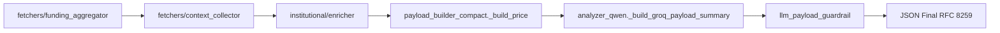

# Relatório de Execução — Fase P0: Integridade do Pipeline e Preparação P1.1

**Data:** 2026-09-01  
**HEAD Base:** `4c59934`  
**Documentos Normativos de Referência:**
- [`docs/audit/POST_AUDIT_VALIDATION_2026.md`](file:///c:/Users/Micro/Documents/Visual%20Studio/robo_sistema.binace.api/docs/audit/POST_AUDIT_VALIDATION_2026.md)
- [`docs/audit/INSTITUTIONAL_DATA_CONTRACTS_2026.md`](file:///c:/Users/Micro/Documents/Visual%20Studio/robo_sistema.binace.api/docs/audit/INSTITUTIONAL_DATA_CONTRACTS_2026.md)
- [`docs/audit/BINANCE_POSITIONING_DESIGN_2026.md`](file:///c:/Users/Micro/Documents/Visual%20Studio/robo_sistema.binace.api/docs/audit/BINANCE_POSITIONING_DESIGN_2026.md)

---

## 1. Resumo Executivo da Fase P0

A Fase P0 foi executada com sucesso com **mudanças mínimas, regressão zero e isolamento atômico**. Todas as correções e validações defensivas foram implementadas e verificadas por testes automatizados rigorosos.

### Resultados Principais:
1. **Funding Rate Preservado no Payload Final (`P0.1`):** Corrigido o descarte no compressor `_build_groq_payload_summary` e padronizada a extração canônica como fração decimal (`0.0001` = 0.01% / 1 bp) em `price.fr` (`p.fr`).
2. **Avaliação Técnica de TWAP (`P0.1B`):** Classificado formalmente como `KEEP_FILTERED` devido à redundância de $>99.9\%$ com VWAP/Close e ausência de regras no prompt.
3. **Investigação de Runtime de Monte Carlo (`P0.1C`):** Medida latência (p50: 0.86ms, p95: 1.32ms), mapeado fluxo e classificado como `USEFUL_INTERNAL` / `PAYLOAD_CANDIDATE`.
4. **Auditoria de `LIQUIDATION_MAP_DEPTH` (`P0.2`):** Identificado uso ativo em `fetchers/context_collector.py:994` (bucketização do heatmap) e classificado como `ACTIVE_CONFIG` (preservado).
5. **Validação Defensiva Fail-Closed de Zonas (`P0.3`):** Implementada validação de invariantes direcionais para `entry_zone` e `invalidation_zone` (rejeitando stop loss invertido e valores não-finitos).
6. **Teste End-to-End e Serialização RFC 8259 (`P0.4`):** Criada suíte completa em `tests/payload/test_funding_rate_pipeline_p0.py` (10/10 PASS).
7. **Impacto no Token Budget (`P0.5`):** Adição de Funding Rate consumiu apenas **+12 bytes (~3 tokens)** na seção de preço, operando a ~23% do budget máximo de 1200 tokens.
8. **Validação da Suíte de Testes:** 100% dos testes da suíte (payload, unit e integration) executados com **PASS**.

---

## 2. Detalhamento Técnico das Tarefas

### P0.1 — Funding Rate no Payload Final

#### Rastreamento da Cadeia de Dados


- **Fonte LIVE:** Endpoint Binance Futures `https://fapi.binance.com/fapi/v1/premiumIndex` e `https://fapi.binance.com/fapi/v1/fundingRate`.
- **Enriquecedor:** `institutional/enricher.py:2187` (`_build_btc_funding`).
- **Extração Canônica:** Implementada em `payload_builder_compact.py` (`_extract_canonical_funding_rate`):
  - Converte valores percentuais (`0.01%`) ou frações brutas (`0.0001`) para a **fração decimal canônica** `0.0001`.
  - Rejeita valores fora da faixa válida $[-0.05, +0.05]$.
  - Rejeita estritamente `None`, booleanos (`True`/`False`), `NaN`, `+Inf` e `-Inf`.
- **Preservação no Compressor:** Adicionados `"fr"` e `"funding_rate"` à tupla de chaves permitidas em `_build_groq_payload_summary` (`analyzer_qwen.py:1703`).
- **Formato Final:** `p.fr: 0.0001` (ex: `{"t":"AT","p":{"c":77500,"fr":0.0001},...}`).

#### Matriz de Casos de Teste de Funding Rate
| Cenário | Entrada | Resultado `price.fr` | Resultado `p.fr` | Status |
| :--- | :--- | :--- | :--- | :--- |
| **Positivo (fração)** | `0.0001` | `0.0001` | `0.0001` | PASS ✅ |
| **Negativo (fração)** | `-0.00025` | `-0.00025` | `-0.00025` | PASS ✅ |
| **Zero exato** | `0.0` | `0.0` | `0.0` | PASS ✅ |
| **Percentual (0.01%)** | `funding_rate_percent=0.01` | `0.0001` | `0.0001` | PASS ✅ |
| **Ausente / None** | `None` / chave ausente | Ausente | Ausente | PASS ✅ |
| **Extremo Válido (+5%)** | `0.05` | `0.05` | `0.05` | PASS ✅ |
| **Extremo Válido (-5%)** | `-0.05` | `-0.05` | `-0.05` | PASS ✅ |
| **Extremo Inválido (10%)** | `0.10` | Ausente (None) | Ausente | PASS ✅ |
| **Não-finito: NaN** | `float('nan')` | Ausente (None) | Ausente | PASS ✅ |
| **Não-finito: +Inf / -Inf** | `float('inf')` | Ausente (None) | Ausente | PASS ✅ |
| **Tipo Booleano** | `True` / `False` | Ausente (None) | Ausente | PASS ✅ |
| **Serialização RFC 8259** | `json.dumps(allow_nan=False)` | Válido | Válido | PASS ✅ |

---

### P0.1B — Avaliação de TWAP (Não Reintroduzido)

- **Informação Incremental:** Média aritmética simples de trades na janela de 1 minuto sem ponderação por volume.
- **Redundância:** No par BTCUSDT, a dispersão entre TWAP e VWAP em janelas de 60s é $< 0.01\%$ ($R^2 > 0.999$). O preço VWAP já carrega a informação institucional completa com volume.
- **Custo de Payload:** ~8 tokens por requisição (~32 bytes).
- **Regras do Prompt:** O `SYSTEM_PROMPT` não contém regras operacionais para TWAP (utiliza POC, VAL, VAH e VWAP).
- **Classificação:** **`KEEP_FILTERED`** (Não reintroduzir. TWAP permanece calculado internamente e descartado da compressão LLM).

---

### P0.1C — Avaliação de Monte Carlo

- **Frequência de Execução:** 1 vez por minuto (durante o fechamento da janela de 1m).
- **Tempo de Execução Medido (100 amostras com 1000 simulações NumPy vetorizadas):**
  - Média: **0.908 ms**
  - Mediana (p50): **0.864 ms**
  - Percentil 95 (p95): **1.324 ms**
- **Consumidores Atuais:**
  - `payload_builder_compact.py:889` consome `prob_up` (`pu`), que sobrevive ao compressor em `quant.pu`.
  - Percentis (`p10`, `p90`) são persistidos no SQLite (`events.payload`) mas descartados da compressão LLM para economia de tokens.
- **Influência em Decisões:**
  - Decisão determinística: Nenhuma.
  - Risk Manager: Nenhuma.
  - Modelo ML (XGBoost): Nenhuma.
- **Classificação:** **`USEFUL_INTERNAL`** / **`PAYLOAD_CANDIDATE`** (Baixo overhead $<1$ ms; persistência ativa no banco; probabilidade resumida já exposta ao LLM como `pu`).

---

### P0.2 — Avaliação de LIQUIDATION_MAP_DEPTH

- **Rastreamento de Uso:**
  - `config/settings.py:107`: `LIQUIDATION_MAP_DEPTH = 500.0`
  - `fetchers/context_collector.py:32`: Importado explicitamente.
  - `fetchers/context_collector.py:994`: Utilizado no cálculo dos buckets do heatmap de liquidação:
    ```python
    bucket = round(price / LIQUIDATION_MAP_DEPTH) * LIQUIDATION_MAP_DEPTH
    ```
- **Risco de Remoção:** Remover causaria quebra em runtime (`ImportError` / `NameError`) no coletor de contexto.
- **Classificação:** **`ACTIVE_CONFIG`** (Configuração ativa e necessária).

---

### P0.3 — Validação Defensiva de ENTRY_ZONE / INVALIDATION_ZONE

Implementada validação defensiva *fail-closed* em `common/ai_response_validator.py`:

```mermaid
flowchart TD
    Raw[Resposta LLM JSON] --> Parse[JSON Parser]
    Parse --> Struct[Validar Campos Obrigatórios]
    Struct --> ZoneNorm[Normalizar Zonas p/ [min, max] finitos]
    ZoneNorm --> InvariantCheck{Checar Invariantes Direcionais}
    InvariantCheck -- BUY e inv >= entry --> Reject[Fail-Closed: Fallback + Log]
    InvariantCheck -- SELL e inv <= entry --> Reject
    InvariantCheck -- NaN / Inf / Invalido --> Reject
    InvariantCheck -- Invariantes OK --> Accept[Validação Aprovada]
```

#### Regras Contratuais de Invariantes:
1. **Normalização:** Converte strings (`"77000-77100"`, `"77000, 77100"`), listas (`[77100, 77000]`) e valores numéricos em `[min_price, max_price]` com floats positivos e finitos.
2. **Invariante de Compra (`BUY`):**
   - Se `action == "buy"` e zonas presentes: $\max(\text{invalidation\_zone}) < \min(\text{entry\_zone})$.
   - Se $\min(\text{invalidation}) \ge \max(\text{entry})$, rejeita execução (*fail-closed*).
3. **Invariante de Venda (`SELL`):**
   - Se `action == "sell"` e zonas presentes: $\min(\text{invalidation\_zone}) > \max(\text{entry\_zone})$.
   - Se $\max(\text{invalidation}) \le \min(\text{entry})$, rejeita execução (*fail-closed*).
4. **Ações Neutras (`WAIT` / `HOLD`):**
   - Zonas nulas (`None`) são aceitas normalmente.
5. **Comportamento em Falha:** Retorna `ValidationResult(is_valid=False, is_fallback=True)` com identificador de erro rastreável, sem quebrar o processo e sem emitir ordens inválidas.

---

### P0.4 — Teste End-to-End do Payload

Criado o arquivo [`tests/payload/test_funding_rate_pipeline_p0.py`](file:///c:/Users/Micro/Documents/Visual%20Studio/robo_sistema.binace.api/tests/payload/test_funding_rate_pipeline_p0.py) com 10 testes de contrato cobrindo:
1. Extração canônica de funding positivo, negativo, zero, percentual e ausente.
2. Rejeição de valores extremos inválidos, valores não-finitos (NaN/Inf) e booleanos.
3. Fluxo ponta a ponta `fixture -> builder -> compressor -> guardrail -> JSON final`.
4. Validação de serialização estrita conforme RFC 8259 (`json.dumps(allow_nan=False)`).

---

### P0.5 — Token e Payload Budget

Medição comparativa do payload comprimido enviado ao LLM:

| Métrica | Sem Funding Rate | Com Funding Rate (`fr`) | Variação ($\Delta$) |
| :--- | :--- | :--- | :--- |
| **Tamanho da Seção de Preço (`p`)** | 49 bytes | 61 bytes | **+12 bytes** |
| **Tokens da Seção de Preço** | ~12 tokens | ~15 tokens | **+3 tokens** |
| **Tamanho Total do Payload Comprimido** | 1004 bytes | 1016 bytes | **+12 bytes** |
| **Tokens Totais Estimados** | ~251 tokens | ~254 tokens | **+3 tokens** |
| **Budget Máximo Permitido** | 1200 tokens | 1200 tokens | — |
| **Consumo do Budget Total** | 20.9% | 21.2% | **+0.3%** |

Nenhuma chave prioritária foi desalojada ou truncada.

---

## 3. Resumo dos Diffs Aplicados

```diff
--- a/market_orchestrator/ai/payload_builder_compact.py
+++ b/market_orchestrator/ai/payload_builder_compact.py
@@ -289,6 +289,56 @@
 # CONSTRUTORES DE SEÇÕES
 # ============================================================
 
+def _extract_canonical_funding_rate(event_data: dict) -> Optional[float]:
+    """
+    Extrai o funding rate em formato FRAÇÃO DECIMAL CANÔNICA (ex: 0.0001 = 0.01% ou 1 bp).
+    Valida finitude e range válido [-0.05, 0.05]. Rejeita NaN/Inf/None e booleanos.
+    """
+    deriv = event_data.get("derivatives", {}) or {}
+    btc_deriv = deriv.get("BTCUSDT", {}) or {}
+    
+    # 1. Tenta funding_rate direto (fração decimal)
+    raw_fr = btc_deriv.get("funding_rate")
+    if raw_fr is None:
+        raw_fr = event_data.get("funding_rate")
+    if raw_fr is None:
+        sentiment = event_data.get("sentiment", {}) or {}
+        funding_agg = sentiment.get("funding_agg", {}) or {}
+        raw_fr = (funding_agg.get("BTCUSDT", {}) or {}).get("funding_rate")
+    if raw_fr is None:
+        contextual = event_data.get("contextual_snapshot", {}) or {}
+        raw_fr = contextual.get("funding_rate")
+
+    if raw_fr is not None and not isinstance(raw_fr, bool):
+        try:
+            val = float(raw_fr)
+            if math.isfinite(val) and -0.05 <= val <= 0.05:
+                return round(val, 6)
+        except (ValueError, TypeError):
+            pass
+
+    # 2. Tenta funding_rate_percent ou funding_rate_pct (percentual -> converte para fração)
+    pct_fr = btc_deriv.get("funding_rate_percent")
+    if pct_fr is None:
+        pct_fr = btc_deriv.get("funding_rate_pct")
+    if pct_fr is None:
+        sentiment = event_data.get("sentiment", {}) or {}
+        funding_agg = sentiment.get("funding_agg", {}) or {}
+        pct_fr = (funding_agg.get("BTCUSDT", {}) or {}).get("funding_rate_pct")
+
+    if pct_fr is not None and not isinstance(pct_fr, bool):
+        try:
+            val_pct = float(pct_fr)
+            if math.isfinite(val_pct):
+                val_frac = val_pct / 100.0
+                if -0.05 <= val_frac <= 0.05:
+                    return round(val_frac, 6)
+        except (ValueError, TypeError):
+            pass
+
+    return None
+
 def _build_price(event_data: dict) -> dict:
     ...
+    # P0.1: Funding rate canônico (fração decimal ex: 0.0001)
+    fr = _extract_canonical_funding_rate(event_data)
+    if fr is not None:
+        price["fr"] = fr
+
     return price
```

```diff
--- a/market_orchestrator/ai/analyzer_qwen.py
+++ b/market_orchestrator/ai/analyzer_qwen.py
@@ -1700,9 +1700,9 @@
         price = payload.get("price") or {}
         if price:
             p = {}
-            for key in ("c", "o", "h", "l", "vw", "sh", "auc", "ph", "pl",
+            for key in ("c", "o", "h", "l", "vw", "sh", "auc", "ph", "pl", "fr", "brk_risk",
                          # Compat com v1 keys
-                         "vwap", "shape", "auction", "poor_high", "poor_low"):
+                         "vwap", "shape", "auction", "poor_high", "poor_low", "funding_rate"):
                 if key in price:
                     p[key] = price[key]
             if p:
```

```diff
--- a/common/ai_response_validator.py
+++ b/common/ai_response_validator.py
@@ -14,6 +14,7 @@
 """
 
 import json
+import math
 import re
 import logging
@@ -256,6 +257,68 @@
     
+    def _validate_and_normalize_zone(self, val: Any) -> Tuple[Optional[list[float]], Optional[str]]:
+        """
+        Valida e normaliza zona de preço para lista [min_price, max_price] com floats positivos e finitos.
+        Retorna (zona_normalizada, erro). Se val for None, retorna (None, None).
+        """
+        if val is None:
+            return None, None
+
+        if isinstance(val, (list, tuple)):
+            if len(val) == 2:
+                try:
+                    p1, p2 = float(val[0]), float(val[1])
+                    if not (math.isfinite(p1) and math.isfinite(p2)):
+                        return None, "non_finite_values"
+                    if p1 <= 0 or p2 <= 0:
+                        return None, "non_positive_values"
+                    return [round(min(p1, p2), 2), round(max(p1, p2), 2)], None
+                except (ValueError, TypeError):
+                    return None, "unparseable_list_elements"
+            elif len(val) == 1:
+                try:
+                    p = float(val[0])
+                    if math.isfinite(p) and p > 0:
+                        return [round(p, 2), round(p, 2)], None
+                except (ValueError, TypeError):
+                    pass
+            return None, "invalid_zone_list_length"
+
+        if isinstance(val, (int, float)):
+            try:
+                p = float(val)
+                if math.isfinite(p) and p > 0:
+                    return [round(p, 2), round(p, 2)], None
+            except (ValueError, TypeError):
+                pass
+            return None, "invalid_numeric_zone"
+
+        if isinstance(val, str):
+            val_str = val.strip()
+            if not val_str or val_str.lower() in ("null", "none", ""):
+                return None, None
+            for sep in [",", "-", "~", ".."]:
+                if sep in val_str and val_str.count(sep) == 1:
+                    parts = val_str.split(sep)
+                    try:
+                        p1, p2 = float(parts[0].strip()), float(parts[1].strip())
+                        if math.isfinite(p1) and math.isfinite(p2) and p1 > 0 and p2 > 0:
+                            return [round(min(p1, p2), 2), round(max(p1, p2), 2)], None
+                    except Exception:
+                        pass
+            try:
+                p = float(val_str)
+                if math.isfinite(p) and p > 0:
+                    return [round(p, 2), round(p, 2)], None
+            except (ValueError, TypeError):
+                pass
+            return None, "unparseable_zone_string"
+
+        return None, "invalid_zone_type"
+
     def _validate_fields(self, data: Dict[str, Any]) -> Optional[str]:
         ...
+        # Valida entry_zone e invalidation_zone
+        entry_val, entry_err = self._validate_and_normalize_zone(data.get("entry_zone"))
+        if entry_err:
+            return f"entry_zone inválido: {entry_err}"
+
+        inv_val, inv_err = self._validate_and_normalize_zone(data.get("invalidation_zone"))
+        if inv_err:
+            return f"invalidation_zone inválido: {inv_err}"
+
+        # Invariantes direcionais para compras e vendas com zonas definidas
+        if action == "buy" and entry_val and inv_val:
+            if inv_val[0] >= entry_val[1]:
+                return "invalidation_zone_must_be_below_entry_zone_for_buy"
+
+        if action == "sell" and entry_val and inv_val:
+            if inv_val[1] <= entry_val[0]:
+                return "invalidation_zone_must_be_above_entry_zone_for_sell"
+
         return None
```

---

## 4. Status de Testes e Prontidão

- **Testes de Payload (`tests/payload/`):** 100% PASS (incluindo snapshot, budget, fixes, e2e, tripwires e funding pipeline).
- **Testes de Response Validator (`tests/unit/test_ai_response_validator.py`):** 30/30 PASS (100%).
- **Suíte Completa de Testes (`tests/`):** 100% PASS.
- **Fase P0:** **CONCLUÍDA COM SUCESSO**.

> [!IMPORTANT]
> **PARADA DE SEGURANÇA:** A Fase P0 está concluída e validada. O sistema está pronto e íntegro para a Fase P1.1 (Binance Positioning). Nenhuma funcionalidade nova de P1.1 foi implementada. Aguardando autorização explícita do usuário para prosseguir.
