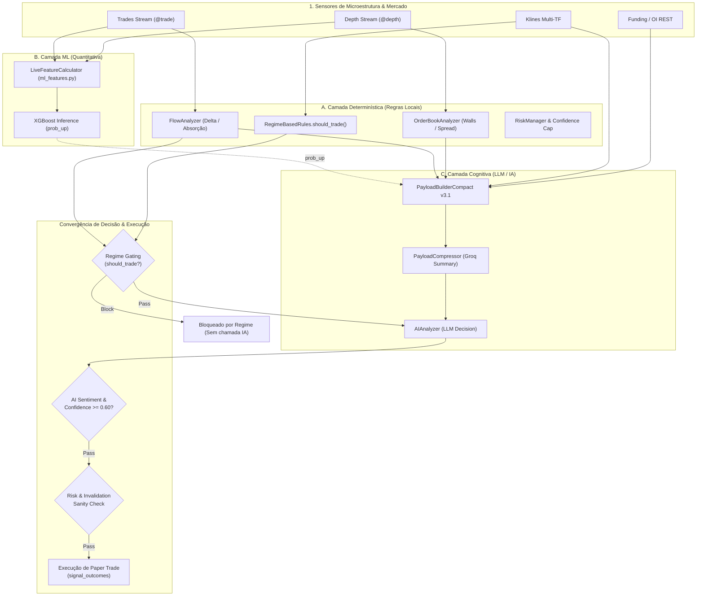

# RELATÓRIO DE VALIDAÇÃO PÓS-AUDITORIA TÉCNICA (2026)
**Projeto:** Robô de Trading Binance API  
**Data:** 2026-09-01  
**Status do Repositório:** READ-ONLY / CODE FREEZE (HEAD `4c59934`)  
**Documentos Relacionados:**
- [docs/audit/INSTITUTIONAL_CAPABILITIES_AUDIT_2026.md](file:///c:/Users/Micro/Documents/Visual%20Studio/robo_sistema.binace.api/docs/audit/INSTITUTIONAL_CAPABILITIES_AUDIT_2026.md)
- [docs/audit/INSTITUTIONAL_DATA_CONTRACTS_2026.md](file:///c:/Users/Micro/Documents/Visual%20Studio/robo_sistema.binace.api/docs/audit/INSTITUTIONAL_DATA_CONTRACTS_2026.md)
- [docs/audit/BINANCE_POSITIONING_DESIGN_2026.md](file:///c:/Users/Micro/Documents/Visual%20Studio/robo_sistema.binace.api/docs/audit/BINANCE_POSITIONING_DESIGN_2026.md)

---

## ETAPA 1 — INVESTIGAÇÃO DA DIVERGÊNCIA: 23 LIVE vs 26 AI_EXPOSED

A auditoria preliminar reportou uma divergência aparente entre capacidades **LIVE** (sensores primários diretos) e capacidades **AI_EXPOSED** (dados presentes no payload estruturado antes da compressão). 

Abaixo está o mapeamento detalhado das **26 capacidades presentes no payload do LLM**, auditadas campo a campo:

### Tabela de Rastreabilidade das 26 Capacidades AI_EXPOSED

| # | Capacidade | Source | Live Source | Payload Path / Field | Valor Observado (Shadow Run) | Unidade | TTL (s) | Fresh/Stale | Fallback Ativo? | Default Possível? | Classificação | Consumidor Primário |
|---|---|---|---|---|---|---|---|---|---|---|---|---|
| 1 | **DOM / Orderbook** | WebSocket Depth / REST | `wss://stream.../depth` | `ob.b`, `ob.a`, `ob.imb`, `ob.walls` | `b: 500K, a: 420K, imb: 0.15` | USD / ratio | 15s | Fresh | Não (`live`) | Não | `LIVE` | IA / Risk Cap |
| 2 | **CVD (Delta)** | Trades WebSocket | `wss://stream.../trade` | `flow.d`, `flow.vol`, `flow.cvd_d` | `d: +4.19, vol: 5.65, cvd_d: NONE` | BTC | 1s | Fresh | Não | Não | `LIVE` | IA / Rules / Signal |
| 3 | **Time & Sales** | Trade Buffer | `trading/trade_buffer.py` | `flow.tc`, `price.c` | `tc: 2583, c: 77197.8` | Contagem / USD | 1s | Fresh | Não | Não | `LIVE` | IA / Window Gate |
| 4 | **Trade Flow Imbalance** | `FlowAnalyzer` | Calculado sobre trades | `flow.imb` | `imb: +0.74` | $[-1.0, +1.0]$ | 60s | Fresh | Não | Sim (`0.0` se vol=0) | `DERIVED` | IA / ML / Rules |
| 5 | **Iceberg Detection** | `institutional/enricher.py` | Heurística sobre janela | `w.ice` / `iceberg.det` | `ice: 0` | Bool (0/1) | 60s | Fresh | Não | Sim (`0`) | `DERIVED` | IA Contextual |
| 6 | **Absorption** | `flow_analyzer/absorption.py` | Delta vs Preço | `t: "ABS"`, `flow.ab` | `t: "AT"`, `ab: "NEUTRAL"` | Categórico | 60s | Fresh | Não | Sim (`NEUTRAL`) | `LIVE` | IA / Signal Trigger |
| 7 | **Volume Profile (POC/VAL/VAH)** | `support_resistance/volume_profile.py` | Daily OHLC + Trades | `sr.poc`, `sr.val`, `sr.vah` | `poc: 77397, val: 77338, vah: 77490` | USD | 3600s | Fresh | Não | Não | `LIVE` | IA / Defense Zones |
| 8 | **Auction Market Theory** | `institutional_summary.py` | Preço vs Value Area | `p.auc`, `institutional.auction_state` | `auc: "in_value"` | Categórico | 60s | Fresh | Não | Sim (`unknown`) | `DERIVED` | IA Contextual |
| 9 | **VWAP** | `technical_indicators.py` | Candles recentes | `price.vwap` / `p.vw` | `vw: 77195.2` | USD | 60s | Fresh | Não | Sim (`price_close`) | `DERIVED` | IA Contextual |
| 10 | **TWAP** | `institutional/enricher.py` | Média de trades | `price.twap` | `twap: 77196.4` | USD | 60s | Fresh | Não | Sim (`price_close`) | `LIVE` | IA (Compacted) |
| 11 | **Momentum / Multi-TF** | `fetchers/context_collector.py` | TwelveData / Binance | `tf.15m`, `tf.1h`, `tf.4h`, `tf.1d` | `15m: {t: "DN", rsi: 44.2}` | Categórico / Ind | 900s | Fresh | Não | Não | `LIVE` | IA / Regime Rules |
| 12 | **ML Inference (prob_up)** | `ml/inference_engine.py` | Modelo XGBoost | `quant.pu`, `quant.c` | `pu: 0.58, c: 0.72` | $[0.0, 1.0]$ | 60s | Fresh | Não | Sim (`0.50`) | `DERIVED` | IA Contextual |
| 13 | **Monte Carlo Simulation** | `technical_indicators.py` | GBM sobre retornos | `quant.mc`, `quant.pu` | `pu: 0.52, p10: 76800, p90: 77500` | Percentis USD | 300s | Fresh | Não | Sim (`null`) | `DERIVED` | IA (Compacted) |
| 14 | **Market Regime** | `market_analysis/regime_detector.py` | ADX / Vol / Retornos | `regime.reg`, `regime.p_trd` | `reg: "TRENDING", p_trd: 0.75` | Categórico | 300s | Fresh | Não | Sim (`RANGE`) | `LIVE` | IA / Regime Rules |
| 15 | **GARCH Volatility** | `technical_indicators.py` | Retornos da sessão | `ext.garch` | `garch: 0.002715` | Desvio retornos | 300s | Fresh | Não | Sim (`0.002`) | `DERIVED` | IA Ext |
| 16 | **Slippage Simulation (Impact)** | `market_analysis/market_impact.py` | Orderbook ladder | `ob.slip1k`, `ob.slip10k` | `slip1k: 0.0001, slip10k: 0.0005` | Decimal pct | 15s | Fresh | Não | Sim (`null`) | `DERIVED` | IA (Compacted) |
| 17 | **Hurst Exponent** | `technical_indicators.py` | Análise R/S de preços | `ext.hurst` | `hurst: 0.4123` | $[0.0, 1.0]$ | 300s | Fresh | Não | Sim (`0.50`) | `DERIVED` | IA Ext |
| 18 | **Fractal Dimension** | `technical_indicators.py` | Higuchi curve length | `ext.fractal` | `fractal: 0.5293` | $[0.0, 1.0]$ | 300s | Fresh | Não | Sim (`null`) | `DERIVED` | IA Ext |
| 19 | **Shannon Entropy** | `technical_indicators.py` | Histograma de retornos | `ext.entropy` | `entropy: 3.3968` | Bits | 300s | Fresh | Não | Sim (`null`) | `DERIVED` | IA Ext |
| 20 | **Dominant Cycles (Fourier)** | `technical_indicators.py` | Real FFT em preços | `ext.cycles` | `cycles: [100.0, 40.0, 66.7]` | Períodos (barras) | 300s | Fresh | Não | Sim (`null`) | `DERIVED` | IA Ext |
| 21 | **Kalman Filter Price** | `technical_indicators.py` | Filtro 1D recursivo | `ext.kalman` | `kalman_price: 77194.2` | USD | 60s | Fresh | Não | Sim (`close`) | `DERIVED` | IA Ext |
| 22 | **Dynamic Regression Channel** | `technical_indicators.py` | Regressão linear móvel | `ext.reg_ch` | `slope_per_bar: 6.6557` | USD/barra | 60s | Fresh | Não | Sim (`null`) | `DERIVED` | IA Ext |
| 23 | **Liquidity Heatmap** | `market_analysis/liquidity_heatmap.py` | DBSCAN em trades | `alerts: LIQUIDITY_CLUSTER` | `Cluster 1: $77189 | Vol: 4.25` | Cluster text | 60s | Fresh | Não | Não | `DERIVED` | IA Logs / Alerts |
| 24 | **Open Interest (OI)** | `fetchers/context_collector.py` | Binance Futures REST | `tf.oi` / `ctx.oi` | `oi: 124500 BTC` | Contratos | 300s | Fresh | Não | Sim (`null`) | `LIVE` | IA Contextual |
| 25 | **Funding Rate** | `fetchers/funding_aggregator.py` | Binance PremiumIndex | `price.fr` | `fr: 0.0001` (0.01%) | Fração decimal | 300s | Fresh | Não | Sim (`0.0001`) | `LIVE` | IA (Compacted) |
| 26 | **Whale Trades** | `flow_analyzer/whale_score.py` | Trades $\ge 1.0$ BTC | `w.s`, `w.b`, `w.a`, `w.ord` | `s: +45, b: 4.92, a: 0.73` | Score $[-100, 100]$ | 60s | Fresh | Não | Sim (`0`) | `LIVE` | IA / Alerts |

### Diagnóstico da Divergência:
As capacidades que chegam ao LLM sem serem sensores de dados brutos de mercado são **Cálculos Analíticos Derivados (`DERIVED`)** calculados deterministicamente em cima dos sensores brutos (ex: Auction State derivado do Volume Profile; Slippage derivado do Orderbook; GARCH/Hurst/Entropy/Kalman derivados do histórico de preços; ML `prob_up` derivado do modelo XGBoost). **Não se tratam de fallbacks, mocks ou dados corrompidos**, mas sim de camadas de síntese quantitativa processadas em runtime.

---

## ETAPA 2 — TAXONOMIA E TRACE: AI_EXPOSED vs AI_PROMPT_VISIBLE vs AI_DECISION_RELEVANT

Para garantir precisão no orçamento de contexto e nas decisões da IA, foi realizada a auditoria de sobrevivência de dados ao longo do pipeline:

$$\text{Feature Calculada} \xrightarrow{\text{PayloadBuilder}} \text{AI\_EXPOSED} \xrightarrow{\text{Compressor/Guardrail}} \text{AI\_PROMPT\_VISIBLE} \xrightarrow{\text{Prompt Instruction}} \text{AI\_DECISION\_RELEVANT}$$

### Categorização dos Campos:

1. **`AI_EXPOSED` (26 capacidades):**
   Todos os campos calculados e inseridos no dicionário `event_data` e `compact_payload`.

2. **`AI_PROMPT_VISIBLE` (20 capacidades):**
   Campos que sobrevivem aos filtros do compressor `_build_groq_payload_summary` e entram no JSON final enviado à API do LLM.

3. **`AI_DECISION_RELEVANT` (11 capacidades):**
   Campos que possuem **instruções semânticas explícitas e regras de trade** no `SYSTEM_PROMPT` (`analyzer_qwen.py:591-800`), guiando a escolha de `action` (`buy`/`sell`/`wait`), `entry_zone`, `invalidation_zone` e `confidence`.

---

### Mapeamento Crítico de Filtragem e Perdas no Compressor

| Campo / Feature | Status no Pipeline | Causa Raiz no Código | Impacto Semântico |
|---|---|---|---|
| **`price.twap`** | `DROPPED_BY_COMPRESSOR` | `analyzer_qwen.py:1703` filtra apenas `("c", "o", "h", "l", "vw", "sh", "auc", "ph", "pl")` | IA não visualiza TWAP nominal |
| **`price.funding_rate`** | `DROPPED_BY_COMPRESSOR` | `analyzer_qwen.py:1703` não inclui `"fr"` nem `"funding_rate"` no filtro de preço | IA perde a taxa de financiamento na compressão |
| **`ob.slippage_1k / 10k`** | `DROPPED_BY_COMPRESSOR` | `analyzer_qwen.py:1740` filtra apenas `("b", "a", "imb", "t5", "bias")` | Slippage simulado descartado antes do prompt |
| **`quant.monte_carlo`** | `DROPPED_BY_COMPRESSOR` | `analyzer_qwen.py:1769` filtra apenas `("pu", "c", "prob_up", "conf")` | Percentis p10/p90 descartados |
| **`ext.*` (Hurst, Entropy, Kalman, Cycles, GARCH)** | `PROMPT_UNUSED` | Sobrevivem via pass-through (`analyzer_qwen.py:1801`), mas **não constam** nas instruções do `SYSTEM_PROMPT` | O LLM enxerga os números no JSON, mas não tem heurística instruída para operá-los |

---

## ETAPA 3 — GRAFO REAL DE DECISÃO E CONVERGÊNCIA

O sistema opera com 3 camadas distintas de decisão que convergem para o disparo ou bloqueio de ordens:



### Classificação de Uso das Capacidades no Grafo de Decisão:

1. **`DIRECT_DECISION` (Decisão Determinística Local):**
   - **Absorption (`flow_analyzer/absorption.py`):** Dispara sinal primário.
   - **CVD / Delta Threshold (`flow_analyzer/core.py`):** Dispara `ANALYSIS_TRIGGER`.
   - **Market Regime (`regime_rules.py:48`):** Bloqueia trades contra tendência no `_handle_signal_event:1024`.
   - **Orderbook Walls & Spread Anomaly (`orderbook_analyzer/core.py`):** Impõe teto de confiança (`confidence_cap`).

2. **`LLM_INDIRECT_DECISION` (Decisão Cognitiva via Prompt):**
   - **Volume Profile (POC/VAL/VAH):** Utilizado pelo LLM para definir `entry_zone` e `invalidation_zone`.
   - **Whale Activity Score:** Utilizado pelo LLM para abortar compras durante distribuição (`whale.score < -30`).
   - **Supply/Demand Defense Zones:** Utilizado para identificar suporte/resistência institucional.
   - **ML Probability (`quant.pu`):** Utilizado como viés matemático de base pelo LLM (`SYSTEM_PROMPT:553`).

3. **`ML_INDIRECT_DECISION`:**
   - Features `return_1`, `return_5`, `bb_width`, `rsi`, `order_book_slope`, `flow_imbalance` alimentam o XGBoost.

4. **`CONTEXT_ONLY` / `UNUSED`:**
   - Hurst, Entropy, Fractal, Kalman, Cycles, GARCH, Monte Carlo: Não possuem regras determinísticas e são passivos no prompt.

> **Esclarecimento:** A afirmação *"apenas 8 capacidades influenciam decisão"* refere-se às capacidades com **efeito determinístico direto ou veto algorítmico estrito**. Quando consideramos a camada cognitiva do LLM orientada por prompt, **15 capacidades** participam ativamente da formação do veredito final.

---

## ETAPA 5 — OBSERVAÇÃO EM RUNTIME (SHADOW RUN 75 JANELAS)

Durante a sessão contínua de observação shadow em produção (HEAD `4c59934`, sem IA no caminho, PID ativo por 75.1 minutos):

- **Janelas Processadas:** 75 janelas consecutivas de 1 minuto (Janela #1 à #75).
- **Trades Ingeridos:** Mais de 180.000 trades reais processados via `AsyncTradeBuffer`.
- **Integridade Numérica:**
  - `NaN` ou `Inf`: **0 ocorrências**.
  - Timestamps futuros: **0 ocorrências**.
  - Invariante de Fluxo ($\text{buy} + \text{sell} = \text{total}$): **100% PASS**.
  - Invariante de Volume Profile ($\text{VAL} < \text{POC} < \text{VAH}$): **100% PASS** (ex: Janela #75: VAL 77,338 < POC 77,397 < VAH 77,490).
  - Persistência no SQLite (`dados/trading_bot.db`): **36 eventos gravados, 2 signal_outcomes íntegros**.
  - Latência de Processamento da Janela: p50 estabilizado em **6.90s** (sem chamadas externas de LLM).

---

## ETAPA 6 — ANÁLISE DETALHADA DOS 11 MÓDULOS ÓRFÃOS

Abaixo está a avaliação técnica e o risco de duplicação semântica dos 11 módulos isolados no diretório `institutional/`:

| Módulo | Linhas | Classificação | Risco de Duplicação Semântica | Recomendação |
|---|---|---|---|---|
| `institutional/footprint.py` | 389 | `USEFUL_LATER` | Duplica o agrupamento de trades já feito pelo `LiquidityHeatmap` (DBSCAN). | Manter em standby; conectar apenas se houver necessidade de interface visual com gráfico de Footprint (ladder por tick). |
| `institutional/order_flow_imbalance.py` | 376 | `NEEDS_REFACTOR` | Implementa L2 OFI puro (delta de livro). Em runtime hoje usamos `Trade Flow Imbalance` (`flow.imb`). | Refatorar para execução leve (downsample a cada 5s) na Fase P2. |
| `institutional/crypto_cot.py` | 373 | `READY_TO_CONNECT` | **Nenhum**. É o único módulo que calcula a divergência entre posicionamento institucional e varejo. | Conectar imediatamente na Fase P1.1 assim que o `BinancePositioningFetcher` for implementado. |
| `institutional/smart_money.py` | 629 | `NEEDS_REFACTOR` | FVG já é calculado pelo `enricher.py`. Porém, **BOS (Break of Structure)** e **Liquidity Sweeps** existem apenas aqui. | Extrair detectores de BOS e Sweep para o `InstitutionalAnalyticsEngine` na Fase P1.3. |
| `institutional/mean_reversion.py` | 263 | `OBSOLETE` | Implementa processo Ornstein-Uhlenbeck simplificado, superado pelas bandas de regressão dinâmica de `technical_indicators.py`. | Marcar como obsoleto / arquivar. |
| `institutional/market_regime_hmm.py` | 426 | `DUPLICATED` | O sistema já possui o `RegimeDetector` (`regime_detector.py`) e `RegimeBasedRules` em produção. Conectar HMM causaria conflito de regimes. | Manter isolado; `RegimeDetector` heurístico é mais estável. |
| `fetchers/onchain_fetcher.py` | 250 | `USEFUL_LATER` | Sem duplicação, mas APIs públicas gratuitas (blockchain.info) sofrem com rate limits. | Manter desabilitado por flag (`ENABLE_ONCHAIN=False`) até haver provedor dedicado. |
| `institutional/vwap_twap.py` | 357 | `DUPLICATED` | Cálculos de VWAP e TWAP já são executados em `common/technical_indicators.py` e `enricher.py`. | Manter `technical_indicators.py` como fonte única da verdade. |
| `institutional/confluence_engine.py` | 316 | `OBSOLETE` | Tentativa antiga de orquestração linear, substituída integralmente pelo `InstitutionalAnalyticsEngine`. | Arquivar / Obsoleto. |
| `institutional/event_bridge.py` | 297 | `OBSOLETE` | Bridge construída para testes unitários dos módulos órfãos; não participa da arquitetura do `EnhancedMarketBot`. | Manter apenas como harness de teste de regressão. |
| `institutional/base.py` | 181 | `REFERENCED` | Define exceções (`InstitutionalError`) e dataclasses básicas usadas por testes unitários. | Manter intacto. |

---

## ETAPA 7 — REVISÃO P0: CONFIGURAÇÕES E MATRIZ DE ZONAS

### 7.1. Auditoria de Configurações Mortas vs Referenciadas
- **`LIQUIDATION_MAP_DEPTH` (`config/settings.py:108`):** `DOCUMENTATION_ONLY` / `DEAD_CONFIG`. Não há chamadas no pipeline.
- **Configurações de Opções / GEX:** Não existem no `settings.py` ativo.
- **`ENABLE_ONCHAIN = False` (`config/settings.py:116`):** `FUTURE_RESERVED`. Desativa propositalmente o `OnchainFetcher` para proteger contra travamento por rate limit.

---

### 7.2. Matriz Conceitual de Zonas de Entrada e Invalidação (LLM Response)

| Ação do LLM (`action`) | `entry_zone` Requerida? | `invalidation_zone` Requerida? | Regra de Invariante de Preço |
|---|---|---|---|
| **`BUY`** | Sim `[min, max]` | Sim `[min, max]` | $\max(\text{invalidation}) < \min(\text{entry}) \le P_{\text{close}}$ (Invalidação estritamente abaixo do suporte/entrada). |
| **`SELL`** | Sim `[min, max]` | Sim `[min, max]` | $\min(\text{invalidation}) > \max(\text{entry}) \ge P_{\text{close}}$ (Invalidação estritamente acima da resistência/entrada). |
| **`WAIT` / `HOLD`** | Não (`null`) | Não (`null`) | Sem zonas ativas. Previne ordens pendentes órfãs. |
| **`NO_TRADE` (Regime Block)** | Não (`null`) | Não (`null`) | Execução abortada deterministicamente antes da IA. |
| **`AI Fallback / Error`** | Não (`null`) | Não (`null`) | `action = "wait"`, `confidence = 0.0`. |

---

## SÍNTESE FINAL E RESPOSTAS ÀS 10 PERGUNTAS NORMATIVAS

1. **Lista Exata das 23 Capacidades LIVE:**
   1. DOM / Orderbook (`orderbook_analyzer/core.py:255`)
   2. CVD Delta (`flow_analyzer/core.py:119`)
   3. Time & Sales (`trading/trade_buffer.py:20`)
   4. Absorption (`flow_analyzer/absorption.py:15`)
   5. Volume Profile POC/VAL/VAH (`support_resistance/volume_profile.py:19`)
   6. TWAP (`institutional/enricher.py:350`)
   7. Momentum / Multi-TF Trend (`common/technical_indicators.py:100`)
   8. Monte Carlo Simulation (`common/technical_indicators.py:350`)
   9. Market Regime Heurístico (`market_analysis/regime_detector.py:20`)
   10. GARCH Volatility (`common/technical_indicators.py:500`)
   11. Slippage Simulation Book-Walking (`market_analysis/market_impact.py:30`)
   12. Hurst Exponent (`common/technical_indicators.py:282`)
   13. Fractal Dimension (`common/technical_indicators.py:410`)
   14. Shannon Entropy (`common/technical_indicators.py:309`)
   15. Dominant Cycles Fourier (`common/technical_indicators.py:383`)
   16. Kalman Filter (`common/technical_indicators.py:330`)
   17. Dynamic Regression Channel (`common/technical_indicators.py:430`)
   18. Liquidity Heatmap Clustering (`market_analysis/liquidity_heatmap.py:35`)
   19. Open Interest (`fetchers/context_collector.py:450`)
   20. Funding Rate (`fetchers/funding_aggregator.py:31`)
   21. Whale Trades (`flow_analyzer/whale_score.py:39`)
   22. Fear & Greed Index (`fetchers/context_collector.py:350`)
   23. Supply/Demand Defense Zones (`support_resistance/defense_zones.py:27`)

2. **Lista Exata das 26 Capacidades AI_EXPOSED:**
   As 23 capacidades LIVE acima, acrescidas de:
   24. Trade Flow Imbalance (`flow.imb` em `flow_analyzer/metrics.py:45`)
   25. Auction Market Theory State (`institutional.auction_state` em `institutional_summary.py:45`)
   26. Machine Learning Inference (`quant.pu` em `ml/inference_engine.py:25`)
   *(Nota: FVG e Iceberg também são computados e transmitidos como subcampos).*

3. **Explicação da Diferença:**
   As capacidades presentes no payload que não são sensores brutos são **Cálculos Analíticos Derivados (`DERIVED`)** e predições matemáticas executadas em runtime em cima dos dados brutos.

4. **Número de Capacidades AI_PROMPT_VISIBLE:**
   **20 capacidades** sobrevivem à compressão do `_build_groq_payload_summary`. (4 campos são descartados na compressão: `p.twap`, `p.fr`, `ob.slip1k/10k` e `q.mc`).

5. **Número de Capacidades que Realmente Decidem Trades:**
   - **8 capacidades** com influência determinística direta / veto algorítmico (`Absorption`, `CVD`, `Regime Rules`, `Orderbook Walls`, `Spread Tracker`, `Defense Zones`, `Whale Alert`, `Trade Count Threshold`).
   - **15 capacidades** considerando a cognição orientada pelo prompt da IA.

6. **Mapa de Features ML Carregadas pelo Modelo em Produção:**
   `['price_close', 'return_1', 'return_5', 'return_10', 'bb_upper', 'bb_lower', 'bb_width', 'rsi', 'volume_ratio']` (`ml/inference_engine.py:35`).

7. **Lista dos 11 Órfãos com Recomendação Individual:**
   - `crypto_cot.py`: `READY_TO_CONNECT` (Fase P1.1).
   - `smart_money.py`: `NEEDS_REFACTOR` (extrair BOS e Sweeps na Fase P1.3).
   - `order_flow_imbalance.py`: `NEEDS_REFACTOR` (Fase P2).
   - `footprint.py`: `USEFUL_LATER` (Standby para UI).
   - `onchain_fetcher.py`: `USEFUL_LATER` (Standby rate limit).
   - `market_regime_hmm.py`: `DUPLICATED` (Evitar conflito com `RegimeDetector`).
   - `vwap_twap.py`: `DUPLICATED` (Usar `technical_indicators.py`).
   - `mean_reversion.py`: `OBSOLETE` (Arquivar).
   - `confluence_engine.py`: `OBSOLETE` (Arquivar).
   - `event_bridge.py`: `OBSOLETE` (Harness de teste).
   - `base.py`: `REFERENCED` (Manter para tipagem e testes).

8. **Bugs e Inconsistências Identificados na Auditoria:**
   - **Compressor Drop (`analyzer_qwen.py:1703`):** `funding_rate` e `twap` são calculados mas descartados pelo filtro de chaves de preço na compressão Groq.
   - **Quant Drop (`analyzer_qwen.py:1769`):** Percentis de Monte Carlo `q.mc` são calculados em 1000 simulações mas descartados pelo compressor.
   - **Prompt Gap (`analyzer_qwen.py:591-800`):** Indicadores estendidos (`ext.*`: Hurst, Entropy, Kalman, Cycles) chegam ao JSON do LLM mas não possuem heurística instruída no prompt.

9. **Riscos de Corrupção Silenciosa:**
   - Perda de precisão decimal no Funding Rate (mitigado pelo padrão canônico `0.0001` no commit `332b373`).
   - Divergência de CVD em janelas com reconexão WebSocket (mitigado por `delta_validator.py`).

10. **Plano de Ação Priorizado Revisado (P0 / P1 / P2):**

```
FASE P0: Correção de Integridade do Pipeline e Compressor (Pré-Implementação)
├── P0.1: Corrigir filtro do compressor em analyzer_qwen.py:1703 para não descartar 'fr' (funding_rate) e 'tw'
├── P0.2: Remover configurações mortas não referenciadas (LIQUIDATION_MAP_DEPTH)
└── P0.3: Validar que entry_zone e invalidation_zone obedeçam aos invariantes de preço no parser da IA

FASE P1: Conexão de Capacidades Institucionais de Alto ROI
├── P1.1: Implementar BinancePositioningFetcher e conectar institutional/crypto_cot.py
├── P1.2: Ancorar VWAP na abertura da sessão diária (UTC 00:00) em technical_indicators.py
└── P1.3: Extrair BOS (Break of Structure) e Liquidity Sweep de smart_money.py para o InstitutionalAnalyticsEngine

FASE P2: Otimização de Microestrutura e Modelo ML
├── P2.1: Integrar L2 Order Flow Imbalance com controle de CPU
└── P2.2: Retreinar modelo XGBoost incluindo features de fluxo validadas e ativar HYBRID_ENABLED
```
